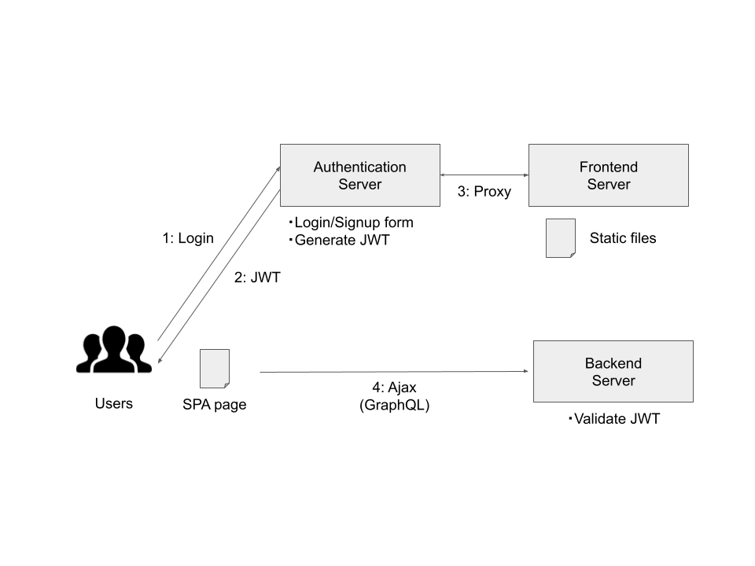

# Meower

Task management application




## Description

This application is written in Rust ([1]) for many components. For the frontend,
it uses Sycamore ([2]), a SPA (Single Page Application) framework that uses
WebAssembly. For the backend and authentication reverse proxy server, it uses
Axum ([3]), a web server framework based on Tokio ([4]). It also uses SeaORM
([5]) as a tool for database migration and model generation.

- [1] [Rust](https://www.rust-lang.org)
- [2] [Sycamore](https://sycamore-rs.netlify.app)
- [3] [Axum](https://github.com/tokio-rs/axum)
- [4] [Tokio](https://tokio.rs)
- [5] [SeaORM](https://www.sea-ql.org/SeaORM)


## Directory structure

In this chapter, we will discuss the configuration files and directories in
this repository. However, we will only list the important components, not
everything.

```
.
├ dev/                     ... Source files
│   ├ docker/              ... Contains Dockerfiles for containers
│   │   ├ base/            ... Docker base images for service containers
│   │   └ service/         ... Docker images for service containers
│   ├ common/              ... Contains common files for the entire application
│   │   ├ assets/          ... Contains common asset files
│   │   │   ├ css/
│   │   │   └ scss/
│   │   ├ src/             ... Utility functions
│   │   └ Cargo.toml
│   ├ auth_proxy/          ... Authentication reverse proxy server
│   │   └ templates/       ... Login page, Signup page, etc.
│   ├ backend/             ... Application backend server
│   ├ frontend/            ... Application backend server
│   ├ entity/              ... Database table entities
│   ├ migration/           ... Database migration
│   │   └ src/
│   │       ├ install/     ... Utility for installing test data and initial data
│   │       └ migration/   ... Migration files
│   ├ .env                 ... Definition of various environment variables
│   └ docker-compose.yml   ... Management docker containers
│
└ spec/                    ... Specifications
```


## Usage

Run these commands inside the `/dev` directory.

### Initialize project

```sh
$ make init
```

### Run application

```sh
$ make up
$ make logs
```

### Migrate database

```sh
$ make migration
> sea-orm-cli migrate generate [migration file name]
> sea-orm-cli migrate
> sea-orm-cli generate -o entity/src/entities
```

### Install test data

```sh
$ make install bin=install_test_data
```

### Convert SCSS to CSS

```sh
$ make sass
```

### Login postgres

```sh
$ make db
> psql meower meower
```
