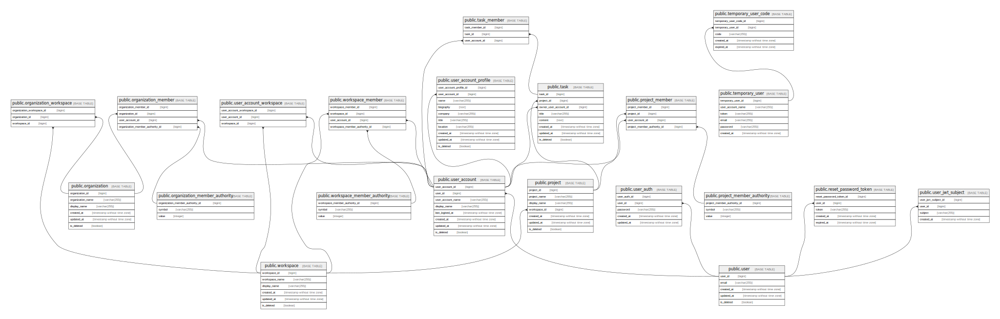

# meower

## Tables

| Name                                                                            | Columns | Comment                       | Type       |
| ------------------------------------------------------------------------------- | ------- | ----------------------------- | ---------- |
| [public.user](public.user.md)                                                   | 5       | User table                    | BASE TABLE |
| [public.user_auth](public.user_auth.md)                                         | 5       | User authentication table     | BASE TABLE |
| [public.user_account](public.user_account.md)                                   | 8       | User account table            | BASE TABLE |
| [public.temporary_user](public.temporary_user.md)                               | 6       | Temporary user                | BASE TABLE |
| [public.temporary_user_code](public.temporary_user_code.md)                     | 5       | Temporary user code           | BASE TABLE |
| [public.organization](public.organization.md)                                   | 6       | Organization table            | BASE TABLE |
| [public.organization_member_authority](public.organization_member_authority.md) | 3       | Organization member authority | BASE TABLE |
| [public.organization_member](public.organization_member.md)                     | 4       | Organization member table     | BASE TABLE |
| [public.workspace](public.workspace.md)                                         | 6       | Workspace table               | BASE TABLE |
| [public.workspace_member_authority](public.workspace_member_authority.md)       | 3       | Workspace member authority    | BASE TABLE |
| [public.workspace_member](public.workspace_member.md)                           | 4       | Workspace member table        | BASE TABLE |
| [public.project](public.project.md)                                             | 7       | Project table                 | BASE TABLE |
| [public.project_member_authority](public.project_member_authority.md)           | 3       | Project member authority      | BASE TABLE |
| [public.project_member](public.project_member.md)                               | 4       | Project member table          | BASE TABLE |
| [public.task](public.task.md)                                                   | 8       | Task table                    | BASE TABLE |
| [public.task_member](public.task_member.md)                                     | 3       | Task member table             | BASE TABLE |
| [public.reset_password_token](public.reset_password_token.md)                   | 5       | Reset passwort token table    | BASE TABLE |
| [public.user_jwt_subject](public.user_jwt_subject.md)                           | 4       | User JWT subject              | BASE TABLE |
| [public.user_account_profile](public.user_account_profile.md)                   | 10      | User account profile table    | BASE TABLE |
| [public.user_account_workspace](public.user_account_workspace.md)               | 3       | User account workspace table  | BASE TABLE |
| [public.organization_workspace](public.organization_workspace.md)               | 3       | Organization workspace table  | BASE TABLE |
| [public.user_jwt_refresh_token](public.user_jwt_refresh_token.md)               | 4       | User JWT refresh token        | BASE TABLE |

## Relations

---

> Generated by [tbls](https://github.com/k1LoW/tbls)
