# meower

## Tables

| Name                                                                            | Columns | Comment | Type       |
| ------------------------------------------------------------------------------- | ------- | ------- | ---------- |
| [public.seaql_migrations](public.seaql_migrations.md)                           | 2       |         | BASE TABLE |
| [public.user](public.user.md)                                                   | 5       |         | BASE TABLE |
| [public.user_auth](public.user_auth.md)                                         | 5       |         | BASE TABLE |
| [public.user_account](public.user_account.md)                                   | 7       |         | BASE TABLE |
| [public.temporary_user](public.temporary_user.md)                               | 4       |         | BASE TABLE |
| [public.temporary_user_token](public.temporary_user_token.md)                   | 4       |         | BASE TABLE |
| [public.organization](public.organization.md)                                   | 6       |         | BASE TABLE |
| [public.organization_member_authority](public.organization_member_authority.md) | 3       |         | BASE TABLE |
| [public.organization_member](public.organization_member.md)                     | 4       |         | BASE TABLE |
| [public.workspace](public.workspace.md)                                         | 7       |         | BASE TABLE |
| [public.workspace_member_authority](public.workspace_member_authority.md)       | 3       |         | BASE TABLE |
| [public.workspace_member](public.workspace_member.md)                           | 4       |         | BASE TABLE |
| [public.project](public.project.md)                                             | 7       |         | BASE TABLE |
| [public.project_member_authority](public.project_member_authority.md)           | 3       |         | BASE TABLE |
| [public.project_member](public.project_member.md)                               | 4       |         | BASE TABLE |
| [public.task](public.task.md)                                                   | 8       |         | BASE TABLE |

## Relations

```mermaid
erDiagram

"public.user_auth" }o--|| "public.user" : "FOREIGN KEY (user_id) REFERENCES "user"(user_id)"
"public.user_account" }o--|| "public.user" : "FOREIGN KEY (user_id) REFERENCES "user"(user_id)"
"public.temporary_user_token" }o--|| "public.temporary_user" : "FOREIGN KEY (temporary_user_id) REFERENCES temporary_user(temporary_user_id)"
"public.organization_member" }o--|| "public.user_account" : "FOREIGN KEY (user_account_id) REFERENCES user_account(user_account_id)"
"public.organization_member" }o--|| "public.organization" : "FOREIGN KEY (organization_id) REFERENCES organization(organization_id)"
"public.organization_member" }o--|| "public.organization_member_authority" : "FOREIGN KEY (organization_member_authority_id) REFERENCES organization_member_authority(organization_member_authority_id)"
"public.workspace" }o--|| "public.organization" : "FOREIGN KEY (organization_id) REFERENCES organization(organization_id)"
"public.workspace_member" }o--|| "public.user_account" : "FOREIGN KEY (user_account_id) REFERENCES user_account(user_account_id)"
"public.workspace_member" }o--|| "public.workspace" : "FOREIGN KEY (workspace_id) REFERENCES workspace(workspace_id)"
"public.workspace_member" }o--|| "public.workspace_member_authority" : "FOREIGN KEY (workspace_member_authority_id) REFERENCES workspace_member_authority(workspace_member_authority_id)"
"public.project" }o--|| "public.workspace" : "FOREIGN KEY (workspace_id) REFERENCES workspace(workspace_id)"
"public.project_member" }o--|| "public.user_account" : "FOREIGN KEY (user_account_id) REFERENCES user_account(user_account_id)"
"public.project_member" }o--|| "public.project" : "FOREIGN KEY (project_id) REFERENCES project(project_id)"
"public.project_member" }o--|| "public.project_member_authority" : "FOREIGN KEY (project_member_authority_id) REFERENCES project_member_authority(project_member_authority_id)"
"public.task" }o--|| "public.user_account" : "FOREIGN KEY (owner_user_account_id) REFERENCES user_account(user_account_id)"
"public.task" }o--|| "public.project" : "FOREIGN KEY (project_id) REFERENCES project(project_id)"

"public.seaql_migrations" {
  varchar version
  bigint applied_at
}
"public.user" {
  bigint user_id
  varchar_255_ email
  timestamp_without_time_zone created_at
  timestamp_without_time_zone updated_at
  boolean is_deleted
}
"public.user_auth" {
  bigint user_auth_id
  bigint user_id FK
  varchar_255_ password
  timestamp_without_time_zone created_at
  timestamp_without_time_zone updated_at
}
"public.user_account" {
  bigint user_account_id
  bigint user_id FK
  varchar_255_ user_account_name
  varchar_255_ display_name
  timestamp_without_time_zone created_at
  timestamp_without_time_zone updated_at
  boolean is_deleted
}
"public.temporary_user" {
  bigint temporary_user_id
  varchar_255_ email
  varchar_255_ password
  timestamp_without_time_zone created_at
}
"public.temporary_user_token" {
  bigint temporary_user_token_id
  bigint temporary_user_id FK
  varchar_255_ token
  timestamp_without_time_zone created_at
}
"public.organization" {
  bigint organization_id
  varchar_255_ organization_name
  varchar_255_ display_name
  timestamp_without_time_zone created_at
  timestamp_without_time_zone updated_at
  boolean is_deleted
}
"public.organization_member_authority" {
  bigint organization_member_authority_id
  varchar_255_ symbol
  integer value
}
"public.organization_member" {
  bigint organization_member_id
  bigint organization_id FK
  bigint user_account_id FK
  bigint organization_member_authority_id FK
}
"public.workspace" {
  bigint workspace_id
  varchar_255_ workspace_name
  varchar_255_ display_name
  bigint organization_id FK
  timestamp_without_time_zone created_at
  timestamp_without_time_zone updated_at
  boolean is_deleted
}
"public.workspace_member_authority" {
  bigint workspace_member_authority_id
  varchar_255_ symbol
  integer value
}
"public.workspace_member" {
  bigint workspace_member_id
  bigint workspace_id FK
  bigint user_account_id FK
  bigint workspace_member_authority_id FK
}
"public.project" {
  bigint project_id
  varchar_255_ project_name
  varchar_255_ display_name
  bigint workspace_id FK
  timestamp_without_time_zone created_at
  timestamp_without_time_zone updated_at
  boolean is_deleted
}
"public.project_member_authority" {
  bigint project_member_authority_id
  varchar_255_ symbol
  integer value
}
"public.project_member" {
  bigint project_member_id
  bigint project_id FK
  bigint user_account_id FK
  bigint project_member_authority_id FK
}
"public.task" {
  bigint task_id
  bigint project_id FK
  bigint owner_user_account_id FK
  varchar_255_ title
  text content
  timestamp_without_time_zone created_at
  timestamp_without_time_zone updated_at
  boolean is_deleted
}
```

---

> Generated by [tbls](https://github.com/k1LoW/tbls)
