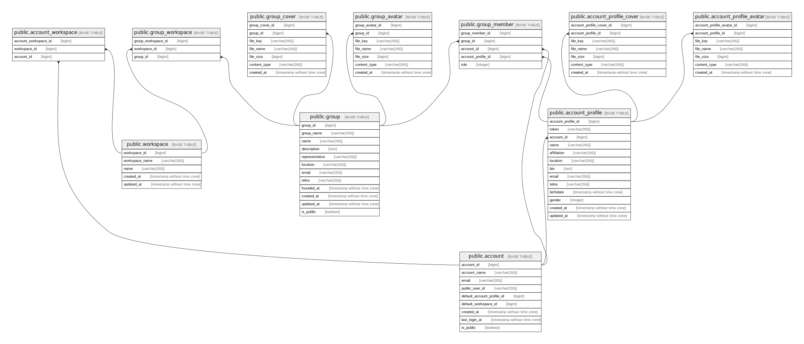

# meower_account

## Tables

| Name                                                              | Columns | Comment                      | Type       |
| ----------------------------------------------------------------- | ------- | ---------------------------- | ---------- |
| [public.account](public.account.md)                               | 9       | Account table                | BASE TABLE |
| [public.account_profile](public.account_profile.md)               | 13      | Account profile table        | BASE TABLE |
| [public.group](public.group.md)                                   | 12      | Group table                  | BASE TABLE |
| [public.group_member](public.group_member.md)                     | 5       | Group member table           | BASE TABLE |
| [public.workspace](public.workspace.md)                           | 5       | Workspace table              | BASE TABLE |
| [public.account_workspace](public.account_workspace.md)           | 3       | Account workspace table      | BASE TABLE |
| [public.group_workspace](public.group_workspace.md)               | 3       | Group workspace table        | BASE TABLE |
| [public.account_profile_avatar](public.account_profile_avatar.md) | 7       | Account profile avatar table | BASE TABLE |
| [public.account_profile_cover](public.account_profile_cover.md)   | 7       | Account profile cover table  | BASE TABLE |
| [public.group_avatar](public.group_avatar.md)                     | 7       | Group avatar table           | BASE TABLE |
| [public.group_cover](public.group_cover.md)                       | 7       | Group cover table            | BASE TABLE |

## Relations

---

> Generated by [tbls](https://github.com/k1LoW/tbls)
