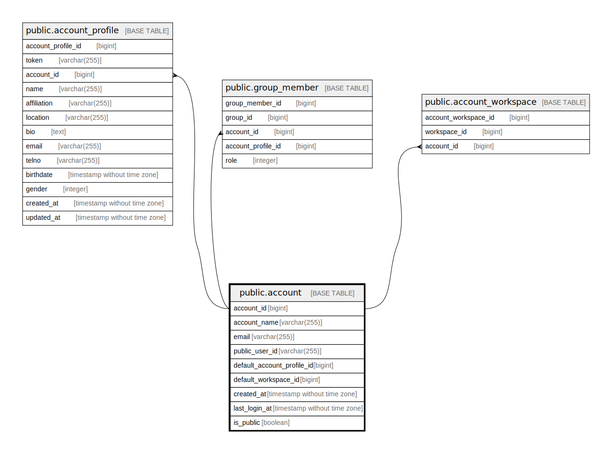

# public.account

## Description

Account table

## Columns

| Name         | Type                        | Default                                     | Nullable | Children                                                                                                                                                  | Parents | Comment      |
| ------------ | --------------------------- | ------------------------------------------- | -------- | --------------------------------------------------------------------------------------------------------------------------------------------------------- | ------- | ------------ |
| account_id   | bigint                      | nextval('account_account_id_seq'::regclass) | false    | [public.account_profile](public.account_profile.md) [public.group_member](public.group_member.md) [public.account_workspace](public.account_workspace.md) |         | Account ID   |
| account_name | varchar(255)                |                                             | false    |                                                                                                                                                           |         | Account name |
| user_subject | varchar(255)                |                                             | false    |                                                                                                                                                           |         | User subject |
| created_at   | timestamp without time zone | CURRENT_TIMESTAMP                           | false    |                                                                                                                                                           |         | Create date  |

## Constraints

| Name                     | Type        | Definition               |
| ------------------------ | ----------- | ------------------------ |
| account_pkey             | PRIMARY KEY | PRIMARY KEY (account_id) |
| account_account_name_key | UNIQUE      | UNIQUE (account_name)    |
| account_user_subject_key | UNIQUE      | UNIQUE (user_subject)    |

## Indexes

| Name                     | Definition                                                                                |
| ------------------------ | ----------------------------------------------------------------------------------------- |
| account_pkey             | CREATE UNIQUE INDEX account_pkey ON public.account USING btree (account_id)               |
| account_account_name_key | CREATE UNIQUE INDEX account_account_name_key ON public.account USING btree (account_name) |
| account_user_subject_key | CREATE UNIQUE INDEX account_user_subject_key ON public.account USING btree (user_subject) |

## Relations

---

> Generated by [tbls](https://github.com/k1LoW/tbls)
