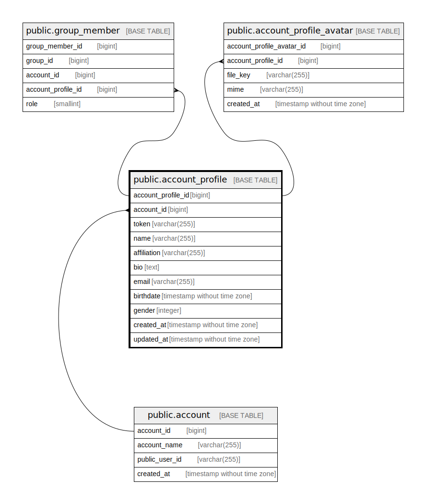

# public.account_profile

## Description

Account profile table

## Columns

| Name               | Type                        | Default                                                     | Nullable | Children                                      | Parents                             | Comment            |
| ------------------ | --------------------------- | ----------------------------------------------------------- | -------- | --------------------------------------------- | ----------------------------------- | ------------------ |
| account_profile_id | bigint                      | nextval('account_profile_account_profile_id_seq'::regclass) | false    | [public.group_member](public.group_member.md) |                                     | Account profile ID |
| account_id         | bigint                      |                                                             | false    |                                               | [public.account](public.account.md) | Account ID         |
| name               | varchar(255)                |                                                             | true     |                                               |                                     | Name               |
| affiliation        | varchar(255)                |                                                             | true     |                                               |                                     | Affiliation        |
| bio                | text                        |                                                             | true     |                                               |                                     | Biography          |
| email              | varchar(255)                |                                                             | true     |                                               |                                     | Email              |
| birthdate          | timestamp without time zone | '1970-01-01 00:00:00'::timestamp without time zone          | true     |                                               |                                     | Birthdate          |
| gender             | smallint                    |                                                             | true     |                                               |                                     | Gender             |
| created_at         | timestamp without time zone | CURRENT_TIMESTAMP                                           | false    |                                               |                                     | Create date        |
| updated_at         | timestamp without time zone | CURRENT_TIMESTAMP                                           | false    |                                               |                                     | Update date        |

## Constraints

| Name                            | Type        | Definition                                                                |
| ------------------------------- | ----------- | ------------------------------------------------------------------------- |
| account_profile_account_id_fkey | FOREIGN KEY | FOREIGN KEY (account_id) REFERENCES account(account_id) ON DELETE CASCADE |
| account_profile_pkey            | PRIMARY KEY | PRIMARY KEY (account_profile_id)                                          |

## Indexes

| Name                           | Definition                                                                                          |
| ------------------------------ | --------------------------------------------------------------------------------------------------- |
| account_profile_pkey           | CREATE UNIQUE INDEX account_profile_pkey ON public.account_profile USING btree (account_profile_id) |
| account_profile_account_id_idx | CREATE INDEX account_profile_account_id_idx ON public.account_profile USING btree (account_id)      |

## Relations

---

> Generated by [tbls](https://github.com/k1LoW/tbls)
