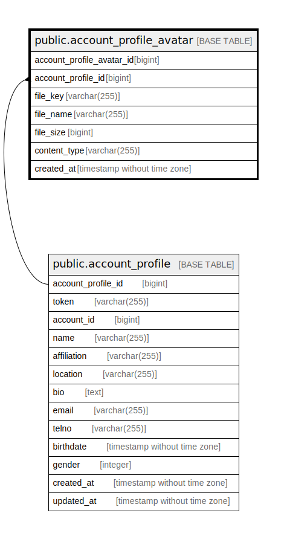

# public.account_profile_avatar

## Description

Account profile avatar table

## Columns

| Name                      | Type                        | Default                                                                   | Nullable | Children | Parents                                             | Comment                  |
| ------------------------- | --------------------------- | ------------------------------------------------------------------------- | -------- | -------- | --------------------------------------------------- | ------------------------ |
| account_profile_avatar_id | bigint                      | nextval('account_profile_avatar_account_profile_avatar_id_seq'::regclass) | false    |          |                                                     |                          |
| account_profile_id        | bigint                      |                                                                           | false    |          | [public.account_profile](public.account_profile.md) | Account profile ID       |
| file_key                  | varchar(255)                |                                                                           | false    |          |                                                     | Avatar file key          |
| file_name                 | varchar(255)                |                                                                           | true     |          |                                                     | Avatar file name         |
| file_size                 | bigint                      |                                                                           | false    |          |                                                     | Avatar file size         |
| content_type              | varchar(255)                |                                                                           | false    |          |                                                     | Avatar file content type |
| created_at                | timestamp without time zone | CURRENT_TIMESTAMP                                                         | false    |          |                                                     | Create date              |

## Constraints

| Name                                           | Type        | Definition                                                                                        |
| ---------------------------------------------- | ----------- | ------------------------------------------------------------------------------------------------- |
| account_profile_avatar_account_profile_id_fkey | FOREIGN KEY | FOREIGN KEY (account_profile_id) REFERENCES account_profile(account_profile_id) ON DELETE CASCADE |
| account_profile_avatar_pkey                    | PRIMARY KEY | PRIMARY KEY (account_profile_avatar_id)                                                           |
| account_profile_avatar_file_key_key            | UNIQUE      | UNIQUE (file_key)                                                                                 |

## Indexes

| Name                                          | Definition                                                                                                                   |
| --------------------------------------------- | ---------------------------------------------------------------------------------------------------------------------------- |
| account_profile_avatar_pkey                   | CREATE UNIQUE INDEX account_profile_avatar_pkey ON public.account_profile_avatar USING btree (account_profile_avatar_id)     |
| account_profile_avatar_file_key_key           | CREATE UNIQUE INDEX account_profile_avatar_file_key_key ON public.account_profile_avatar USING btree (file_key)              |
| account_profile_avatar_account_profile_id_idx | CREATE INDEX account_profile_avatar_account_profile_id_idx ON public.account_profile_avatar USING btree (account_profile_id) |

## Relations

---

> Generated by [tbls](https://github.com/k1LoW/tbls)
