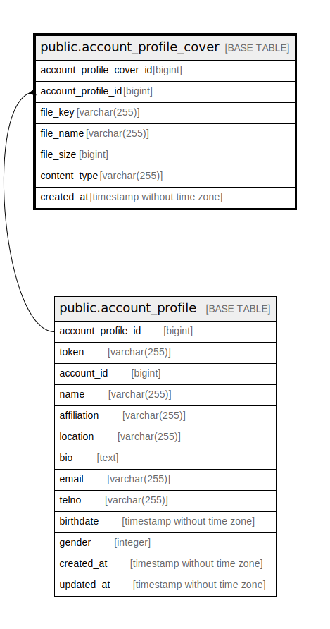

# public.account_profile_cover

## Description

Account profile cover table

## Columns

| Name                     | Type                        | Default                                                                 | Nullable | Children | Parents                                             | Comment                 |
| ------------------------ | --------------------------- | ----------------------------------------------------------------------- | -------- | -------- | --------------------------------------------------- | ----------------------- |
| account_profile_cover_id | bigint                      | nextval('account_profile_cover_account_profile_cover_id_seq'::regclass) | false    |          |                                                     |                         |
| account_profile_id       | bigint                      |                                                                         | false    |          | [public.account_profile](public.account_profile.md) | Account profile ID      |
| file_key                 | varchar(255)                |                                                                         | false    |          |                                                     | Cover file key          |
| file_name                | varchar(255)                |                                                                         | true     |          |                                                     | Cover file name         |
| file_size                | bigint                      |                                                                         | false    |          |                                                     | Cover file size         |
| content_type             | varchar(255)                |                                                                         | false    |          |                                                     | Cover file content type |
| created_at               | timestamp without time zone | CURRENT_TIMESTAMP                                                       | false    |          |                                                     | Create date             |

## Constraints

| Name                                          | Type        | Definition                                                                                        |
| --------------------------------------------- | ----------- | ------------------------------------------------------------------------------------------------- |
| account_profile_cover_account_profile_id_fkey | FOREIGN KEY | FOREIGN KEY (account_profile_id) REFERENCES account_profile(account_profile_id) ON DELETE CASCADE |
| account_profile_cover_pkey                    | PRIMARY KEY | PRIMARY KEY (account_profile_cover_id)                                                            |
| account_profile_cover_file_key_key            | UNIQUE      | UNIQUE (file_key)                                                                                 |

## Indexes

| Name                                         | Definition                                                                                                                 |
| -------------------------------------------- | -------------------------------------------------------------------------------------------------------------------------- |
| account_profile_cover_pkey                   | CREATE UNIQUE INDEX account_profile_cover_pkey ON public.account_profile_cover USING btree (account_profile_cover_id)      |
| account_profile_cover_file_key_key           | CREATE UNIQUE INDEX account_profile_cover_file_key_key ON public.account_profile_cover USING btree (file_key)              |
| account_profile_cover_account_profile_id_idx | CREATE INDEX account_profile_cover_account_profile_id_idx ON public.account_profile_cover USING btree (account_profile_id) |

## Relations

---

> Generated by [tbls](https://github.com/k1LoW/tbls)
