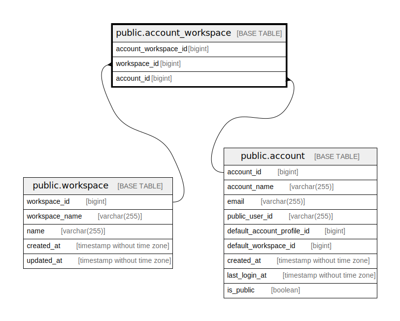

# public.account_workspace

## Description

Account workspace table

## Columns

| Name                 | Type   | Default                                                         | Nullable | Children | Parents                                 | Comment              |
| -------------------- | ------ | --------------------------------------------------------------- | -------- | -------- | --------------------------------------- | -------------------- |
| account_workspace_id | bigint | nextval('account_workspace_account_workspace_id_seq'::regclass) | false    |          |                                         | Account workspace ID |
| workspace_id         | bigint |                                                                 | false    |          | [public.workspace](public.workspace.md) | Workspace ID         |
| account_id           | bigint |                                                                 | false    |          | [public.account](public.account.md)     | Account ID           |

## Constraints

| Name                              | Type        | Definition                                                                      |
| --------------------------------- | ----------- | ------------------------------------------------------------------------------- |
| account_workspace_account_id_fk   | FOREIGN KEY | FOREIGN KEY (account_id) REFERENCES account(account_id) ON DELETE CASCADE       |
| account_workspace_workspace_id_fk | FOREIGN KEY | FOREIGN KEY (workspace_id) REFERENCES workspace(workspace_id) ON DELETE CASCADE |
| account_workspace_pkey            | PRIMARY KEY | PRIMARY KEY (account_workspace_id)                                              |

## Indexes

| Name                               | Definition                                                                                                |
| ---------------------------------- | --------------------------------------------------------------------------------------------------------- |
| account_workspace_pkey             | CREATE UNIQUE INDEX account_workspace_pkey ON public.account_workspace USING btree (account_workspace_id) |
| account_workspace_workspace_id_idx | CREATE INDEX account_workspace_workspace_id_idx ON public.account_workspace USING btree (workspace_id)    |
| account_workspace_account_id_idx   | CREATE INDEX account_workspace_account_id_idx ON public.account_workspace USING btree (account_id)        |

## Relations

---

> Generated by [tbls](https://github.com/k1LoW/tbls)
