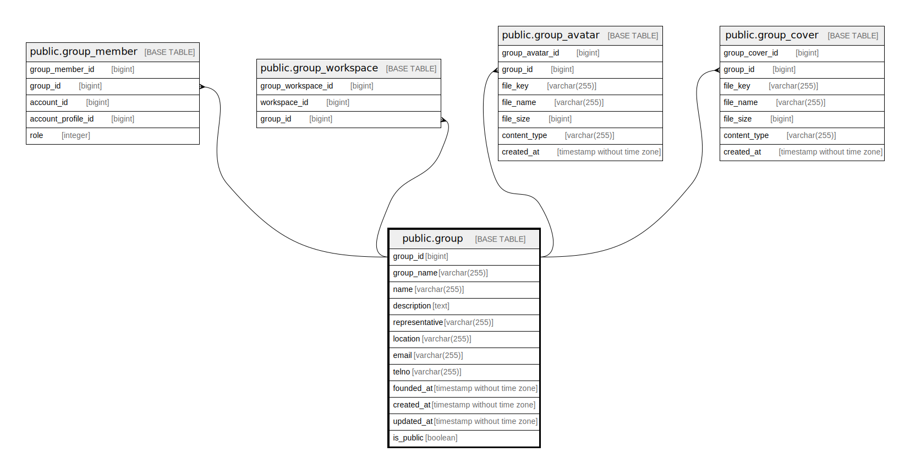

# public.group

## Description

Group table

## Columns

| Name       | Type                        | Default                                 | Nullable | Children                                                                                          | Parents | Comment     |
| ---------- | --------------------------- | --------------------------------------- | -------- | ------------------------------------------------------------------------------------------------- | ------- | ----------- |
| group_id   | bigint                      | nextval('group_group_id_seq'::regclass) | false    | [public.group_member](public.group_member.md) [public.group_workspace](public.group_workspace.md) |         | Group ID    |
| group_name | varchar(255)                |                                         | false    |                                                                                                   |         | Group name  |
| created_at | timestamp without time zone | CURRENT_TIMESTAMP                       | false    |                                                                                                   |         | Create date |
| updated_at | timestamp without time zone | CURRENT_TIMESTAMP                       | false    |                                                                                                   |         | Update date |

## Constraints

| Name                 | Type        | Definition             |
| -------------------- | ----------- | ---------------------- |
| group_pkey           | PRIMARY KEY | PRIMARY KEY (group_id) |
| group_group_name_key | UNIQUE      | UNIQUE (group_name)    |

## Indexes

| Name                 | Definition                                                                          |
| -------------------- | ----------------------------------------------------------------------------------- |
| group_pkey           | CREATE UNIQUE INDEX group_pkey ON public."group" USING btree (group_id)             |
| group_group_name_key | CREATE UNIQUE INDEX group_group_name_key ON public."group" USING btree (group_name) |

## Relations

---

> Generated by [tbls](https://github.com/k1LoW/tbls)
