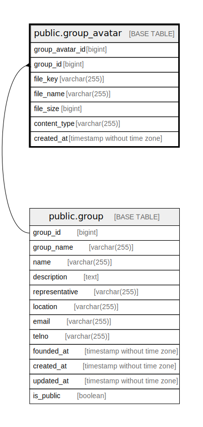

# public.group_avatar

## Description

Group avatar table

## Columns

| Name            | Type                        | Default                                               | Nullable | Children | Parents                         | Comment                  |
| --------------- | --------------------------- | ----------------------------------------------------- | -------- | -------- | ------------------------------- | ------------------------ |
| group_avatar_id | bigint                      | nextval('group_avatar_group_avatar_id_seq'::regclass) | false    |          |                                 |                          |
| group_id        | bigint                      |                                                       | false    |          | [public.group](public.group.md) | Group ID                 |
| file_key        | varchar(255)                |                                                       | false    |          |                                 | Avatar file key          |
| file_name       | varchar(255)                |                                                       | true     |          |                                 | Avatar file name         |
| file_size       | bigint                      |                                                       | false    |          |                                 | Avatar file size         |
| content_type    | varchar(255)                |                                                       | false    |          |                                 | Avatar file content type |
| created_at      | timestamp without time zone | CURRENT_TIMESTAMP                                     | false    |          |                                 | Create date              |

## Constraints

| Name                       | Type        | Definition                                                            |
| -------------------------- | ----------- | --------------------------------------------------------------------- |
| group_avatar_group_id_fkey | FOREIGN KEY | FOREIGN KEY (group_id) REFERENCES "group"(group_id) ON DELETE CASCADE |
| group_avatar_pkey          | PRIMARY KEY | PRIMARY KEY (group_avatar_id)                                         |
| group_avatar_file_key_key  | UNIQUE      | UNIQUE (file_key)                                                     |

## Indexes

| Name                      | Definition                                                                                  |
| ------------------------- | ------------------------------------------------------------------------------------------- |
| group_avatar_pkey         | CREATE UNIQUE INDEX group_avatar_pkey ON public.group_avatar USING btree (group_avatar_id)  |
| group_avatar_file_key_key | CREATE UNIQUE INDEX group_avatar_file_key_key ON public.group_avatar USING btree (file_key) |
| group_avatar_group_id_idx | CREATE INDEX group_avatar_group_id_idx ON public.group_avatar USING btree (group_id)        |

## Relations

---

> Generated by [tbls](https://github.com/k1LoW/tbls)
