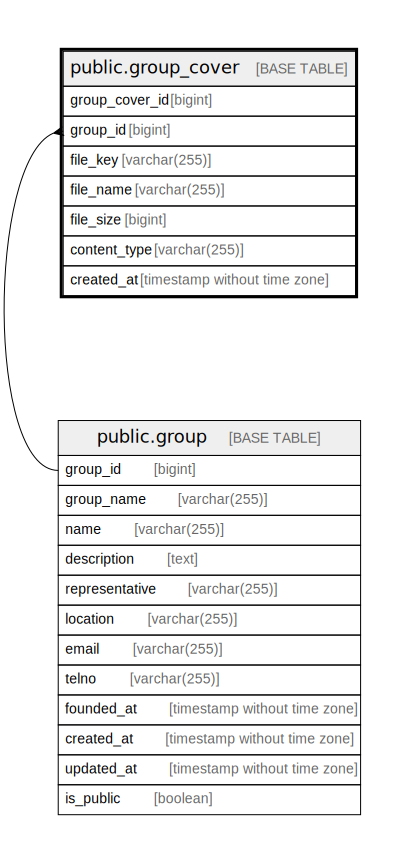

# public.group_cover

## Description

Group cover table

## Columns

| Name           | Type                        | Default                                             | Nullable | Children | Parents                         | Comment                 |
| -------------- | --------------------------- | --------------------------------------------------- | -------- | -------- | ------------------------------- | ----------------------- |
| group_cover_id | bigint                      | nextval('group_cover_group_cover_id_seq'::regclass) | false    |          |                                 |                         |
| group_id       | bigint                      |                                                     | false    |          | [public.group](public.group.md) | Group ID                |
| file_key       | varchar(255)                |                                                     | false    |          |                                 | Cover file key          |
| file_name      | varchar(255)                |                                                     | true     |          |                                 | Cover file name         |
| file_size      | bigint                      |                                                     | false    |          |                                 | Cover file size         |
| content_type   | varchar(255)                |                                                     | false    |          |                                 | Cover file content type |
| created_at     | timestamp without time zone | CURRENT_TIMESTAMP                                   | false    |          |                                 | Create date             |

## Constraints

| Name                      | Type        | Definition                                                            |
| ------------------------- | ----------- | --------------------------------------------------------------------- |
| group_cover_group_id_fkey | FOREIGN KEY | FOREIGN KEY (group_id) REFERENCES "group"(group_id) ON DELETE CASCADE |
| group_cover_pkey          | PRIMARY KEY | PRIMARY KEY (group_cover_id)                                          |
| group_cover_file_key_key  | UNIQUE      | UNIQUE (file_key)                                                     |

## Indexes

| Name                     | Definition                                                                                |
| ------------------------ | ----------------------------------------------------------------------------------------- |
| group_cover_pkey         | CREATE UNIQUE INDEX group_cover_pkey ON public.group_cover USING btree (group_cover_id)   |
| group_cover_file_key_key | CREATE UNIQUE INDEX group_cover_file_key_key ON public.group_cover USING btree (file_key) |
| group_cover_group_id_idx | CREATE INDEX group_cover_group_id_idx ON public.group_cover USING btree (group_id)        |

## Relations

---

> Generated by [tbls](https://github.com/k1LoW/tbls)
