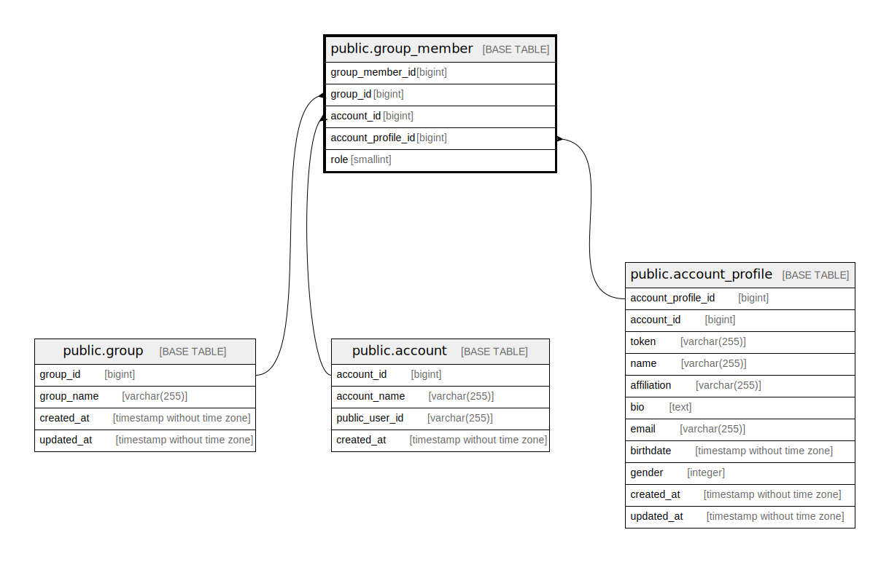

# public.group_member

## Description

Group member table

## Columns

| Name               | Type    | Default                                               | Nullable | Children | Parents                                             | Comment            |
| ------------------ | ------- | ----------------------------------------------------- | -------- | -------- | --------------------------------------------------- | ------------------ |
| group_member_id    | bigint  | nextval('group_member_group_member_id_seq'::regclass) | false    |          |                                                     | Group member ID    |
| group_id           | bigint  |                                                       | false    |          | [public.group](public.group.md)                     | Group ID           |
| account_id         | bigint  |                                                       | false    |          | [public.account](public.account.md)                 | Account ID         |
| account_profile_id | bigint  |                                                       | false    |          | [public.account_profile](public.account_profile.md) | Account profile ID |
| role               | integer |                                                       | true     |          |                                                     | Role               |

## Constraints

| Name                                 | Type        | Definition                                                                      |
| ------------------------------------ | ----------- | ------------------------------------------------------------------------------- |
| group_member_account_id_fkey         | FOREIGN KEY | FOREIGN KEY (account_id) REFERENCES account(account_id) ON DELETE CASCADE       |
| group_member_account_profile_id_fkey | FOREIGN KEY | FOREIGN KEY (account_profile_id) REFERENCES account_profile(account_profile_id) |
| group_member_group_id_fkey           | FOREIGN KEY | FOREIGN KEY (group_id) REFERENCES "group"(group_id) ON DELETE CASCADE           |
| group_member_pkey                    | PRIMARY KEY | PRIMARY KEY (group_member_id)                                                   |

## Indexes

| Name                        | Definition                                                                                 |
| --------------------------- | ------------------------------------------------------------------------------------------ |
| group_member_pkey           | CREATE UNIQUE INDEX group_member_pkey ON public.group_member USING btree (group_member_id) |
| group_member_group_id_idx   | CREATE INDEX group_member_group_id_idx ON public.group_member USING btree (group_id)       |
| group_member_account_id_idx | CREATE INDEX group_member_account_id_idx ON public.group_member USING btree (account_id)   |

## Relations

---

> Generated by [tbls](https://github.com/k1LoW/tbls)
