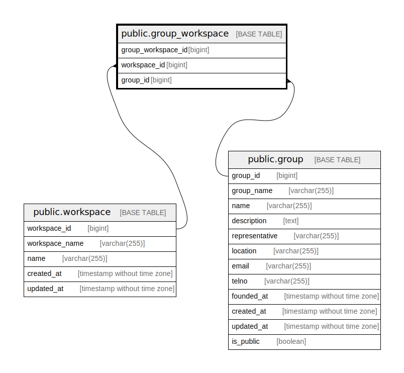

# public.group_workspace

## Description

Group workspace table

## Columns

| Name               | Type   | Default                                                     | Nullable | Children | Parents                                 | Comment            |
| ------------------ | ------ | ----------------------------------------------------------- | -------- | -------- | --------------------------------------- | ------------------ |
| group_workspace_id | bigint | nextval('group_workspace_group_workspace_id_seq'::regclass) | false    |          |                                         | Group workspace ID |
| workspace_id       | bigint |                                                             | false    |          | [public.workspace](public.workspace.md) | Workspace ID       |
| group_id           | bigint |                                                             | false    |          | [public.group](public.group.md)         | Group ID           |

## Constraints

| Name                            | Type        | Definition                                                                      |
| ------------------------------- | ----------- | ------------------------------------------------------------------------------- |
| group_workspace_group_id_fk     | FOREIGN KEY | FOREIGN KEY (group_id) REFERENCES "group"(group_id) ON DELETE CASCADE           |
| group_workspace_workspace_id_fk | FOREIGN KEY | FOREIGN KEY (workspace_id) REFERENCES workspace(workspace_id) ON DELETE CASCADE |
| group_workspace_pkey            | PRIMARY KEY | PRIMARY KEY (group_workspace_id)                                                |

## Indexes

| Name                             | Definition                                                                                          |
| -------------------------------- | --------------------------------------------------------------------------------------------------- |
| group_workspace_pkey             | CREATE UNIQUE INDEX group_workspace_pkey ON public.group_workspace USING btree (group_workspace_id) |
| group_workspace_workspace_id_idx | CREATE INDEX group_workspace_workspace_id_idx ON public.group_workspace USING btree (workspace_id)  |
| group_workspace_group_id_idx     | CREATE INDEX group_workspace_group_id_idx ON public.group_workspace USING btree (group_id)          |

## Relations

---

> Generated by [tbls](https://github.com/k1LoW/tbls)
