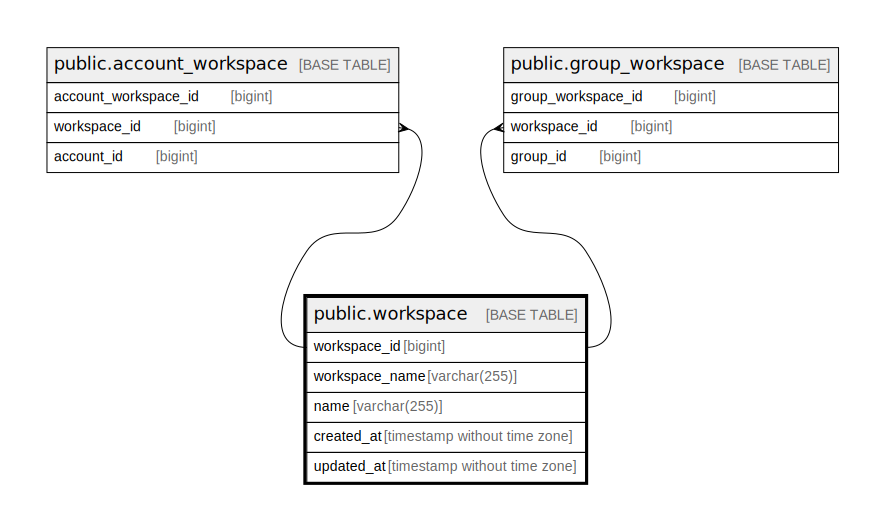

# public.workspace

## Description

Workspace table

## Columns

| Name           | Type                        | Default                                         | Nullable | Children                                                                                                    | Parents | Comment        |
| -------------- | --------------------------- | ----------------------------------------------- | -------- | ----------------------------------------------------------------------------------------------------------- | ------- | -------------- |
| workspace_id   | bigint                      | nextval('workspace_workspace_id_seq'::regclass) | false    | [public.account_workspace](public.account_workspace.md) [public.group_workspace](public.group_workspace.md) |         | Workspace ID   |
| workspace_name | varchar(255)                |                                                 | false    |                                                                                                             |         | Workspace name |
| created_at     | timestamp without time zone | CURRENT_TIMESTAMP                               | false    |                                                                                                             |         | Create date    |
| updated_at     | timestamp without time zone | CURRENT_TIMESTAMP                               | false    |                                                                                                             |         | Update date    |

## Constraints

| Name                         | Type        | Definition                 |
| ---------------------------- | ----------- | -------------------------- |
| workspace_pkey               | PRIMARY KEY | PRIMARY KEY (workspace_id) |
| workspace_workspace_name_key | UNIQUE      | UNIQUE (workspace_name)    |

## Indexes

| Name                         | Definition                                                                                        |
| ---------------------------- | ------------------------------------------------------------------------------------------------- |
| workspace_pkey               | CREATE UNIQUE INDEX workspace_pkey ON public.workspace USING btree (workspace_id)                 |
| workspace_workspace_name_key | CREATE UNIQUE INDEX workspace_workspace_name_key ON public.workspace USING btree (workspace_name) |

## Relations

---

> Generated by [tbls](https://github.com/k1LoW/tbls)
