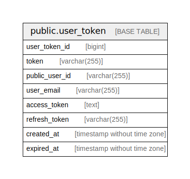

# meower_app

## Tables

| Name                                      | Columns | Comment          | Type       |
| ----------------------------------------- | ------- | ---------------- | ---------- |
| [public.user_token](public.user_token.md) | 8       | User token table | BASE TABLE |

## Relations

---

> Generated by [tbls](https://github.com/k1LoW/tbls)
