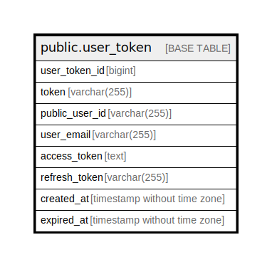

# public.user_token

## Description

User token table

## Columns

| Name          | Type                        | Default                                           | Nullable | Children | Parents | Comment       |
| ------------- | --------------------------- | ------------------------------------------------- | -------- | -------- | ------- | ------------- |
| user_token_id | bigint                      | nextval('user_token_user_token_id_seq'::regclass) | false    |          |         | User token ID |
| token         | varchar(255)                |                                                   | false    |          |         | Token         |
| access_token  | text                        |                                                   | false    |          |         |               |
| refresh_token | varchar(255)                |                                                   | false    |          |         | Refresh token |
| created_at    | timestamp without time zone | CURRENT_TIMESTAMP                                 | false    |          |         | Create date   |
| expired_at    | timestamp without time zone | CURRENT_TIMESTAMP                                 | false    |          |         | Expire date   |

## Constraints

| Name                 | Type        | Definition                  |
| -------------------- | ----------- | --------------------------- |
| user_token_pkey      | PRIMARY KEY | PRIMARY KEY (user_token_id) |
| user_token_token_key | UNIQUE      | UNIQUE (token)              |

## Indexes

| Name                 | Definition                                                                           |
| -------------------- | ------------------------------------------------------------------------------------ |
| user_token_pkey      | CREATE UNIQUE INDEX user_token_pkey ON public.user_token USING btree (user_token_id) |
| user_token_token_key | CREATE UNIQUE INDEX user_token_token_key ON public.user_token USING btree (token)    |

## Relations

---

> Generated by [tbls](https://github.com/k1LoW/tbls)
