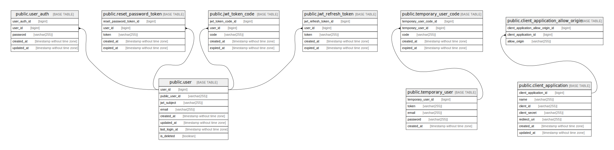

# meower_auth

## Tables

| Name                                                          | Columns | Comment                   | Type       |
| ------------------------------------------------------------- | ------- | ------------------------- | ---------- |
| [public.user](public.user.md)                                 | 7       | User table                | BASE TABLE |
| [public.user_auth](public.user_auth.md)                       | 5       | User authentication table | BASE TABLE |
| [public.temporary_user](public.temporary_user.md)             | 5       | Temporary user table      | BASE TABLE |
| [public.temporary_user_code](public.temporary_user_code.md)   | 5       | Temporary user code table | BASE TABLE |
| [public.reset_password_token](public.reset_password_token.md) | 5       | Reset password table      | BASE TABLE |
| [public.jwt_token_code](public.jwt_token_code.md)             | 5       | JWT token code table      | BASE TABLE |
| [public.jwt_refresh_token](public.jwt_refresh_token.md)       | 5       | JWT refresh token table   | BASE TABLE |
| [public.client_application](public.client_application.md)     | 7       | Client application table  | BASE TABLE |

## Relations

---

> Generated by [tbls](https://github.com/k1LoW/tbls)
