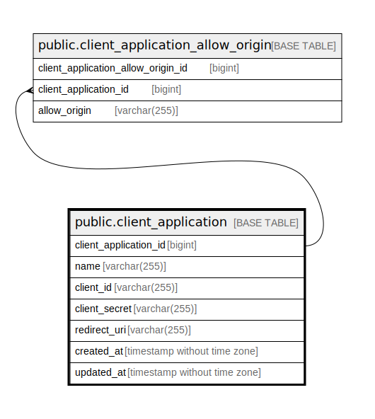

# public.client_application

## Description

Client application table

## Columns

| Name                  | Type                        | Default                                                           | Nullable | Children | Parents | Comment                 |
| --------------------- | --------------------------- | ----------------------------------------------------------------- | -------- | -------- | ------- | ----------------------- |
| client_application_id | bigint                      | nextval('client_application_client_application_id_seq'::regclass) | false    |          |         | Client application ID   |
| name                  | varchar(255)                |                                                                   | false    |          |         | Client application name |
| client_id             | varchar(255)                |                                                                   | false    |          |         | Client ID               |
| client_secret         | varchar(255)                |                                                                   | false    |          |         | Client secret           |
| redirect_uri          | varchar(255)                |                                                                   | false    |          |         | Redirect URI            |
| created_at            | timestamp without time zone | CURRENT_TIMESTAMP                                                 | false    |          |         | Create date             |
| updated_at            | timestamp without time zone | CURRENT_TIMESTAMP                                                 | false    |          |         | Update date             |

## Constraints

| Name                             | Type        | Definition                          |
| -------------------------------- | ----------- | ----------------------------------- |
| client_application_pkey          | PRIMARY KEY | PRIMARY KEY (client_application_id) |
| client_application_client_id_key | UNIQUE      | UNIQUE (client_id)                  |

## Indexes

| Name                             | Definition                                                                                                   |
| -------------------------------- | ------------------------------------------------------------------------------------------------------------ |
| client_application_pkey          | CREATE UNIQUE INDEX client_application_pkey ON public.client_application USING btree (client_application_id) |
| client_application_client_id_key | CREATE UNIQUE INDEX client_application_client_id_key ON public.client_application USING btree (client_id)    |

## Relations

---

> Generated by [tbls](https://github.com/k1LoW/tbls)
