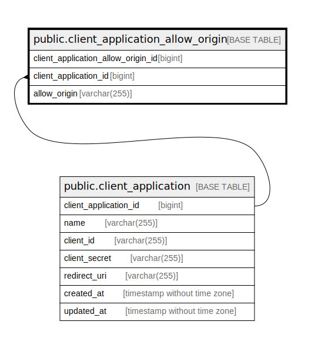

# public.client_application_allow_origin

## Description

Client application allow origin table

## Columns

| Name                               | Type         | Default                                                                              | Nullable | Children | Parents                                                   | Comment                            |
| ---------------------------------- | ------------ | ------------------------------------------------------------------------------------ | -------- | -------- | --------------------------------------------------------- | ---------------------------------- |
| client_application_allow_origin_id | bigint       | nextval('client_application_allow_orig_client_application_allow_orig_seq'::regclass) | false    |          |                                                           | Client application allow origin ID |
| client_application_id              | bigint       |                                                                                      | false    |          | [public.client_application](public.client_application.md) | Client application id              |
| allow_origin                       | varchar(255) |                                                                                      | false    |          |                                                           | Allow origin                       |

## Constraints

| Name                                                       | Type        | Definition                                                                                                 |
| ---------------------------------------------------------- | ----------- | ---------------------------------------------------------------------------------------------------------- |
| client_application_allow_origin_client_application_id_fkey | FOREIGN KEY | FOREIGN KEY (client_application_id) REFERENCES client_application(client_application_id) ON DELETE CASCADE |
| client_application_allow_origin_pkey                       | PRIMARY KEY | PRIMARY KEY (client_application_allow_origin_id)                                                           |

## Indexes

| Name                                                      | Definition                                                                                                                                           |
| --------------------------------------------------------- | ---------------------------------------------------------------------------------------------------------------------------------------------------- |
| client_application_allow_origin_pkey                      | CREATE UNIQUE INDEX client_application_allow_origin_pkey ON public.client_application_allow_origin USING btree (client_application_allow_origin_id)  |
| client_application_allow_origin_client_application_id_idx | CREATE INDEX client_application_allow_origin_client_application_id_idx ON public.client_application_allow_origin USING btree (client_application_id) |

## Relations

---

> Generated by [tbls](https://github.com/k1LoW/tbls)
