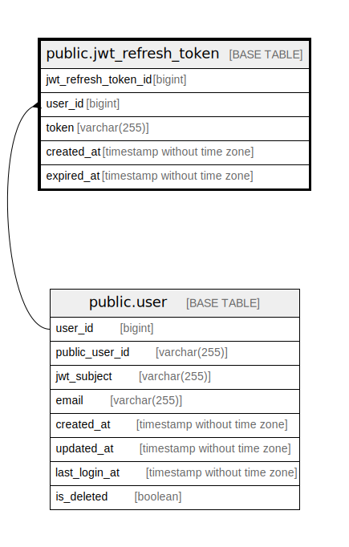

# public.jwt_refresh_token

## Description

JWT refresh token table

## Columns

| Name                 | Type                        | Default                                                         | Nullable | Children | Parents                       | Comment              |
| -------------------- | --------------------------- | --------------------------------------------------------------- | -------- | -------- | ----------------------------- | -------------------- |
| jwt_refresh_token_id | bigint                      | nextval('jwt_refresh_token_jwt_refresh_token_id_seq'::regclass) | false    |          |                               | JWT refresh token ID |
| user_id              | bigint                      |                                                                 | false    |          | [public.user](public.user.md) | User ID              |
| token                | varchar(255)                |                                                                 | false    |          |                               | Token                |
| created_at           | timestamp without time zone | CURRENT_TIMESTAMP                                               | false    |          |                               | Create date          |
| expired_at           | timestamp without time zone | CURRENT_TIMESTAMP                                               | false    |          |                               | Expire date          |

## Constraints

| Name                           | Type        | Definition                                                         |
| ------------------------------ | ----------- | ------------------------------------------------------------------ |
| jwt_refresh_token_user_id_fkey | FOREIGN KEY | FOREIGN KEY (user_id) REFERENCES "user"(user_id) ON DELETE CASCADE |
| jwt_refresh_token_pkey         | PRIMARY KEY | PRIMARY KEY (jwt_refresh_token_id)                                 |
| jwt_refresh_token_token_key    | UNIQUE      | UNIQUE (token)                                                     |

## Indexes

| Name                          | Definition                                                                                                |
| ----------------------------- | --------------------------------------------------------------------------------------------------------- |
| jwt_refresh_token_pkey        | CREATE UNIQUE INDEX jwt_refresh_token_pkey ON public.jwt_refresh_token USING btree (jwt_refresh_token_id) |
| jwt_refresh_token_token_key   | CREATE UNIQUE INDEX jwt_refresh_token_token_key ON public.jwt_refresh_token USING btree (token)           |
| jwt_refresh_token_user_id_idx | CREATE INDEX jwt_refresh_token_user_id_idx ON public.jwt_refresh_token USING btree (user_id)              |

## Relations

---

> Generated by [tbls](https://github.com/k1LoW/tbls)
