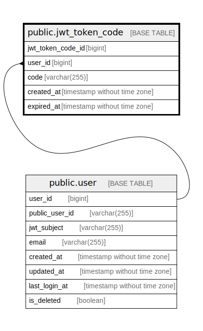

# public.jwt_token_code

## Description

JWT token code table

## Columns

| Name              | Type                        | Default                                                   | Nullable | Children | Parents                       | Comment           |
| ----------------- | --------------------------- | --------------------------------------------------------- | -------- | -------- | ----------------------------- | ----------------- |
| jwt_token_code_id | bigint                      | nextval('jwt_token_code_jwt_token_code_id_seq'::regclass) | false    |          |                               | JWT token code ID |
| user_id           | bigint                      |                                                           | false    |          | [public.user](public.user.md) | User ID           |
| code              | varchar(255)                |                                                           | false    |          |                               | Code              |
| created_at        | timestamp without time zone | CURRENT_TIMESTAMP                                         | false    |          |                               | Create date       |
| expired_at        | timestamp without time zone | CURRENT_TIMESTAMP                                         | false    |          |                               | Expire date       |

## Constraints

| Name                        | Type        | Definition                                       |
| --------------------------- | ----------- | ------------------------------------------------ |
| jwt_token_code_user_id_fkey | FOREIGN KEY | FOREIGN KEY (user_id) REFERENCES "user"(user_id) |
| jwt_token_code_pkey         | PRIMARY KEY | PRIMARY KEY (jwt_token_code_id)                  |
| jwt_token_code_code_key     | UNIQUE      | UNIQUE (code)                                    |

## Indexes

| Name                       | Definition                                                                                       |
| -------------------------- | ------------------------------------------------------------------------------------------------ |
| jwt_token_code_pkey        | CREATE UNIQUE INDEX jwt_token_code_pkey ON public.jwt_token_code USING btree (jwt_token_code_id) |
| jwt_token_code_code_key    | CREATE UNIQUE INDEX jwt_token_code_code_key ON public.jwt_token_code USING btree (code)          |
| jwt_token_code_user_id_idx | CREATE INDEX jwt_token_code_user_id_idx ON public.jwt_token_code USING btree (user_id)           |

## Relations

---

> Generated by [tbls](https://github.com/k1LoW/tbls)
