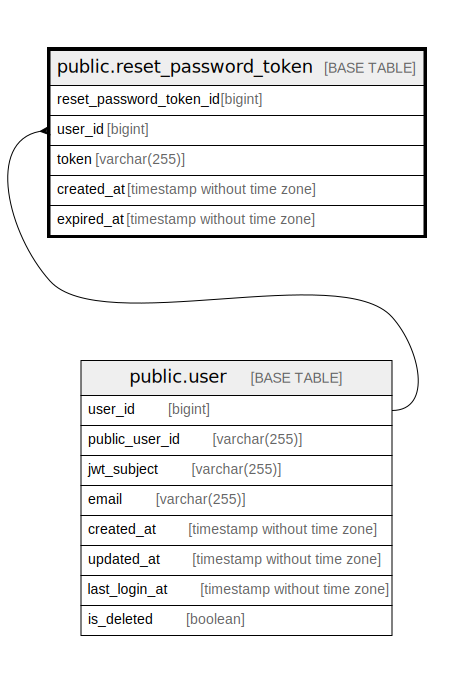

# public.reset_password_token

## Description

Reset password table

## Columns

| Name                    | Type                        | Default                                                               | Nullable | Children | Parents                       | Comment                 |
| ----------------------- | --------------------------- | --------------------------------------------------------------------- | -------- | -------- | ----------------------------- | ----------------------- |
| reset_password_token_id | bigint                      | nextval('reset_password_token_reset_password_token_id_seq'::regclass) | false    |          |                               | Reset password token ID |
| user_id                 | bigint                      |                                                                       | false    |          | [public.user](public.user.md) | User ID                 |
| token                   | varchar(255)                |                                                                       | false    |          |                               | Token                   |
| created_at              | timestamp without time zone | CURRENT_TIMESTAMP                                                     | false    |          |                               | Create date             |
| expired_at              | timestamp without time zone | CURRENT_TIMESTAMP                                                     | false    |          |                               | Expire date             |

## Constraints

| Name                              | Type        | Definition                                       |
| --------------------------------- | ----------- | ------------------------------------------------ |
| reset_password_token_user_id_fkey | FOREIGN KEY | FOREIGN KEY (user_id) REFERENCES "user"(user_id) |
| reset_password_token_pkey         | PRIMARY KEY | PRIMARY KEY (reset_password_token_id)            |
| reset_password_token_token_key    | UNIQUE      | UNIQUE (token)                                   |

## Indexes

| Name                             | Definition                                                                                                         |
| -------------------------------- | ------------------------------------------------------------------------------------------------------------------ |
| reset_password_token_pkey        | CREATE UNIQUE INDEX reset_password_token_pkey ON public.reset_password_token USING btree (reset_password_token_id) |
| reset_password_token_token_key   | CREATE UNIQUE INDEX reset_password_token_token_key ON public.reset_password_token USING btree (token)              |
| reset_password_token_user_id_idx | CREATE INDEX reset_password_token_user_id_idx ON public.reset_password_token USING btree (user_id)                 |

## Relations

---

> Generated by [tbls](https://github.com/k1LoW/tbls)
