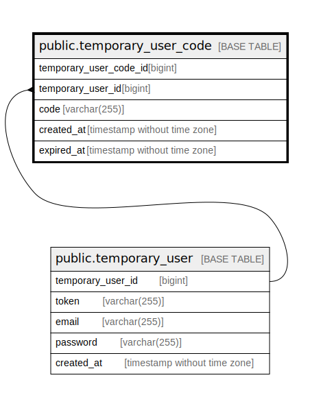

# public.temporary_user_code

## Description

Temporary user code table

## Columns

| Name                   | Type                        | Default                                                             | Nullable | Children | Parents                                           | Comment                |
| ---------------------- | --------------------------- | ------------------------------------------------------------------- | -------- | -------- | ------------------------------------------------- | ---------------------- |
| temporary_user_code_id | bigint                      | nextval('temporary_user_code_temporary_user_code_id_seq'::regclass) | false    |          |                                                   | Temporary user code ID |
| temporary_user_id      | bigint                      |                                                                     | false    |          | [public.temporary_user](public.temporary_user.md) | Temporary user ID      |
| code                   | varchar(255)                |                                                                     | false    |          |                                                   | Code                   |
| created_at             | timestamp without time zone | CURRENT_TIMESTAMP                                                   | false    |          |                                                   | Create date            |
| expired_at             | timestamp without time zone | CURRENT_TIMESTAMP                                                   | false    |          |                                                   | Expire date            |

## Constraints

| Name                                       | Type        | Definition                                                                   |
| ------------------------------------------ | ----------- | ---------------------------------------------------------------------------- |
| temporary_user_code_temporary_user_id_fkey | FOREIGN KEY | FOREIGN KEY (temporary_user_id) REFERENCES temporary_user(temporary_user_id) |
| temporary_user_code_pkey                   | PRIMARY KEY | PRIMARY KEY (temporary_user_code_id)                                         |

## Indexes

| Name                                      | Definition                                                                                                           |
| ----------------------------------------- | -------------------------------------------------------------------------------------------------------------------- |
| temporary_user_code_pkey                  | CREATE UNIQUE INDEX temporary_user_code_pkey ON public.temporary_user_code USING btree (temporary_user_code_id)      |
| temporary_user_code_temporary_user_id_idx | CREATE INDEX temporary_user_code_temporary_user_id_idx ON public.temporary_user_code USING btree (temporary_user_id) |

## Relations

---

> Generated by [tbls](https://github.com/k1LoW/tbls)
