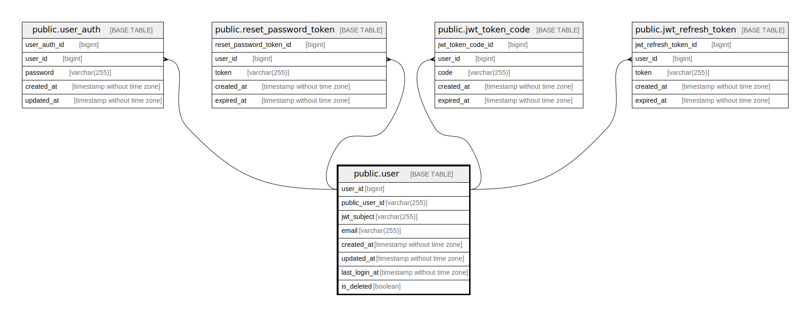

# public.user

## Description

User table

## Columns

| Name            | Type                        | Default                               | Nullable | Children                                                                                                                                                                                                        | Parents | Comment           |
| --------------- | --------------------------- | ------------------------------------- | -------- | --------------------------------------------------------------------------------------------------------------------------------------------------------------------------------------------------------------- | ------- | ----------------- |
| user_id         | bigint                      | nextval('user_user_id_seq'::regclass) | false    | [public.user_auth](public.user_auth.md) [public.reset_password_token](public.reset_password_token.md) [public.jwt_token_code](public.jwt_token_code.md) [public.jwt_refresh_token](public.jwt_refresh_token.md) |         | User ID           |
| public_user_id  | varchar(255)                |                                       | false    |                                                                                                                                                                                                                 |         | Public user ID    |
| jwt_subject     | varchar(255)                |                                       | false    |                                                                                                                                                                                                                 |         | JWT subject       |
| email           | varchar(255)                |                                       | false    |                                                                                                                                                                                                                 |         | Email address     |
| created_at      | timestamp without time zone | CURRENT_TIMESTAMP                     | false    |                                                                                                                                                                                                                 |         | Create date       |
| updated_at      | timestamp without time zone | CURRENT_TIMESTAMP                     | false    |                                                                                                                                                                                                                 |         | Update date       |
| last_logined_at | timestamp without time zone | CURRENT_TIMESTAMP                     | false    |                                                                                                                                                                                                                 |         | Last logined date |
| is_deleted      | boolean                     | false                                 | false    |                                                                                                                                                                                                                 |         | Soft delete flag  |

## Constraints

| Name                    | Type        | Definition              |
| ----------------------- | ----------- | ----------------------- |
| user_pkey               | PRIMARY KEY | PRIMARY KEY (user_id)   |
| user_public_user_id_key | UNIQUE      | UNIQUE (public_user_id) |
| user_jwt_subject_key    | UNIQUE      | UNIQUE (jwt_subject)    |
| user_email_key          | UNIQUE      | UNIQUE (email)          |

## Indexes

| Name                    | Definition                                                                                |
| ----------------------- | ----------------------------------------------------------------------------------------- |
| user_pkey               | CREATE UNIQUE INDEX user_pkey ON public."user" USING btree (user_id)                      |
| user_public_user_id_key | CREATE UNIQUE INDEX user_public_user_id_key ON public."user" USING btree (public_user_id) |
| user_jwt_subject_key    | CREATE UNIQUE INDEX user_jwt_subject_key ON public."user" USING btree (jwt_subject)       |
| user_email_key          | CREATE UNIQUE INDEX user_email_key ON public."user" USING btree (email)                   |

## Relations

---

> Generated by [tbls](https://github.com/k1LoW/tbls)
