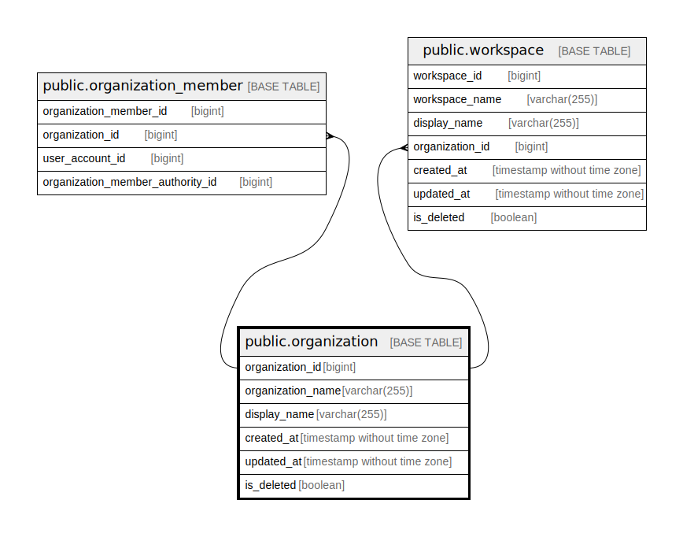

# public.organization

## Description

Organization table

## Columns

| Name              | Type                        | Default                                               | Nullable | Children                                                                                                                                                              | Parents | Comment           |
| ----------------- | --------------------------- | ----------------------------------------------------- | -------- | --------------------------------------------------------------------------------------------------------------------------------------------------------------------- | ------- | ----------------- |
| organization_id   | bigint                      | nextval('organization_organization_id_seq'::regclass) | false    | [public.organization_member](public.organization_member.md) [public.workspace](public.workspace.md) [public.organization_workspace](public.organization_workspace.md) |         | Organization ID   |
| organization_name | varchar(255)                |                                                       | false    |                                                                                                                                                                       |         | Organization name |
| display_name      | varchar(255)                |                                                       | false    |                                                                                                                                                                       |         | Display name      |
| created_at        | timestamp without time zone | CURRENT_TIMESTAMP                                     | false    |                                                                                                                                                                       |         | Create date       |
| updated_at        | timestamp without time zone | CURRENT_TIMESTAMP                                     | false    |                                                                                                                                                                       |         | Update date       |
| is_deleted        | boolean                     | false                                                 | false    |                                                                                                                                                                       |         | Soft delete flag  |

## Constraints

| Name                               | Type        | Definition                    |
| ---------------------------------- | ----------- | ----------------------------- |
| organization_pkey                  | PRIMARY KEY | PRIMARY KEY (organization_id) |
| organization_organization_name_key | UNIQUE      | UNIQUE (organization_name)    |

## Indexes

| Name                               | Definition                                                                                                    |
| ---------------------------------- | ------------------------------------------------------------------------------------------------------------- |
| organization_pkey                  | CREATE UNIQUE INDEX organization_pkey ON public.organization USING btree (organization_id)                    |
| organization_organization_name_key | CREATE UNIQUE INDEX organization_organization_name_key ON public.organization USING btree (organization_name) |

## Relations

---

> Generated by [tbls](https://github.com/k1LoW/tbls)
