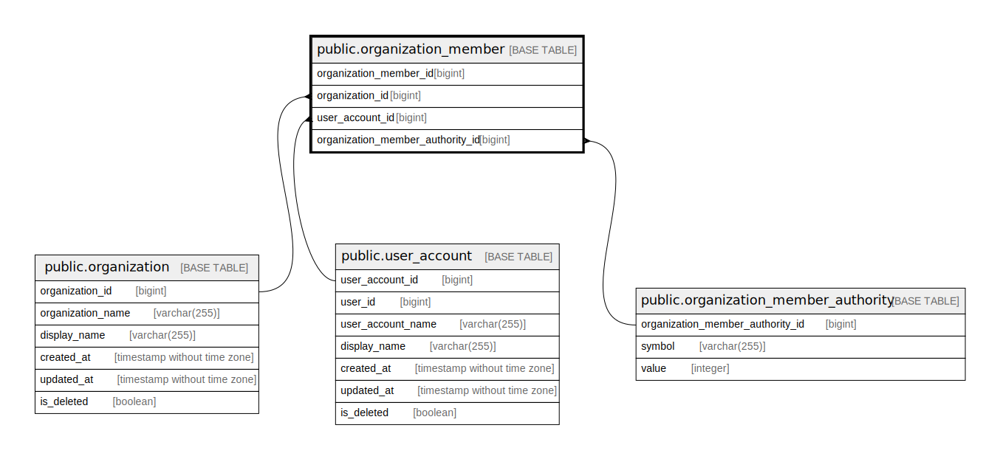

# public.organization_member

## Description

Organization member table

## Columns

| Name                             | Type   | Default                                                             | Nullable | Children | Parents                                                                         | Comment                          |
| -------------------------------- | ------ | ------------------------------------------------------------------- | -------- | -------- | ------------------------------------------------------------------------------- | -------------------------------- |
| organization_member_id           | bigint | nextval('organization_member_organization_member_id_seq'::regclass) | false    |          |                                                                                 | Organization member ID           |
| organization_id                  | bigint |                                                                     | false    |          | [public.organization](public.organization.md)                                   | Organization ID                  |
| user_account_id                  | bigint |                                                                     | false    |          | [public.user_account](public.user_account.md)                                   | User account ID                  |
| organization_member_authority_id | bigint |                                                                     | false    |          | [public.organization_member_authority](public.organization_member_authority.md) | Organization member authority ID |

## Constraints

| Name                                                   | Type        | Definition                                                                                                                |
| ------------------------------------------------------ | ----------- | ------------------------------------------------------------------------------------------------------------------------- |
| organization_member_user_account_id_fkey               | FOREIGN KEY | FOREIGN KEY (user_account_id) REFERENCES user_account(user_account_id)                                                    |
| organization_member_organization_id_fkey               | FOREIGN KEY | FOREIGN KEY (organization_id) REFERENCES organization(organization_id)                                                    |
| organization_member_organization_member_authority_fkey | FOREIGN KEY | FOREIGN KEY (organization_member_authority_id) REFERENCES organization_member_authority(organization_member_authority_id) |
| organization_member_pkey                               | PRIMARY KEY | PRIMARY KEY (organization_member_id)                                                                                      |

## Indexes

| Name                                    | Definition                                                                                                       |
| --------------------------------------- | ---------------------------------------------------------------------------------------------------------------- |
| organization_member_pkey                | CREATE UNIQUE INDEX organization_member_pkey ON public.organization_member USING btree (organization_member_id)  |
| organization_member_organization_id_idx | CREATE INDEX organization_member_organization_id_idx ON public.organization_member USING btree (organization_id) |
| organization_member_user_account_id_idx | CREATE INDEX organization_member_user_account_id_idx ON public.organization_member USING btree (user_account_id) |

## Relations

---

> Generated by [tbls](https://github.com/k1LoW/tbls)
