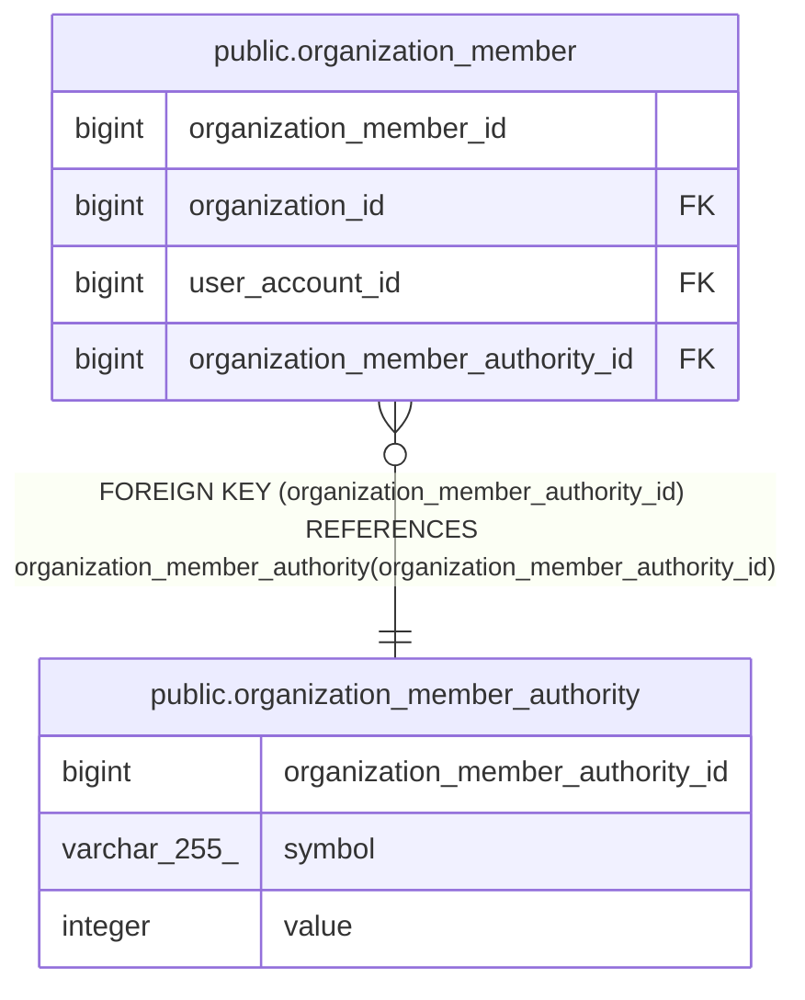

# public.organization_member_authority

## Description

## Columns

| Name                             | Type         | Default                                                                              | Nullable | Children                                                    | Parents | Comment |
| -------------------------------- | ------------ | ------------------------------------------------------------------------------------ | -------- | ----------------------------------------------------------- | ------- | ------- |
| organization_member_authority_id | bigint       | nextval('organization_member_authority_organization_member_authority_seq'::regclass) | false    | [public.organization_member](public.organization_member.md) |         |         |
| symbol                           | varchar(255) |                                                                                      | false    |                                                             |         |         |
| value                            | integer      |                                                                                      | false    |                                                             |         |         |

## Constraints

| Name                               | Type        | Definition                                     |
| ---------------------------------- | ----------- | ---------------------------------------------- |
| organization_member_authority_pkey | PRIMARY KEY | PRIMARY KEY (organization_member_authority_id) |

## Indexes

| Name                               | Definition                                                                                                                                    |
| ---------------------------------- | --------------------------------------------------------------------------------------------------------------------------------------------- |
| organization_member_authority_pkey | CREATE UNIQUE INDEX organization_member_authority_pkey ON public.organization_member_authority USING btree (organization_member_authority_id) |

## Relations

---

> Generated by [tbls](https://github.com/k1LoW/tbls)
