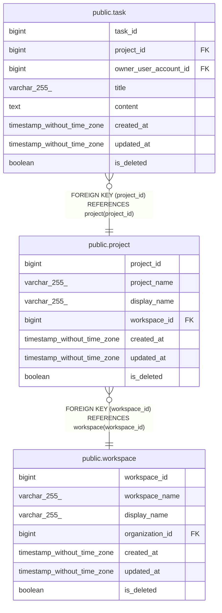

# public.project

## Description

## Columns

| Name         | Type                        | Default                                     | Nullable | Children                      | Parents                                 | Comment |
| ------------ | --------------------------- | ------------------------------------------- | -------- | ----------------------------- | --------------------------------------- | ------- |
| project_id   | bigint                      | nextval('project_project_id_seq'::regclass) | false    | [public.task](public.task.md) |                                         |         |
| project_name | varchar(255)                |                                             | false    |                               |                                         |         |
| display_name | varchar(255)                |                                             | false    |                               |                                         |         |
| workspace_id | bigint                      |                                             | false    |                               | [public.workspace](public.workspace.md) |         |
| created_at   | timestamp without time zone | CURRENT_TIMESTAMP                           | false    |                               |                                         |         |
| updated_at   | timestamp without time zone | CURRENT_TIMESTAMP                           | false    |                               |                                         |         |
| is_deleted   | boolean                     | false                                       | false    |                               |                                         |         |

## Constraints

| Name                      | Type        | Definition                                                    |
| ------------------------- | ----------- | ------------------------------------------------------------- |
| project_workspace_id_fkey | FOREIGN KEY | FOREIGN KEY (workspace_id) REFERENCES workspace(workspace_id) |
| project_pkey              | PRIMARY KEY | PRIMARY KEY (project_id)                                      |

## Indexes

| Name                     | Definition                                                                         |
| ------------------------ | ---------------------------------------------------------------------------------- |
| project_pkey             | CREATE UNIQUE INDEX project_pkey ON public.project USING btree (project_id)        |
| project_project_name_idx | CREATE INDEX project_project_name_idx ON public.project USING btree (project_name) |
| project_workspace_id_idx | CREATE INDEX project_workspace_id_idx ON public.project USING btree (workspace_id) |

## Relations

---

> Generated by [tbls](https://github.com/k1LoW/tbls)
