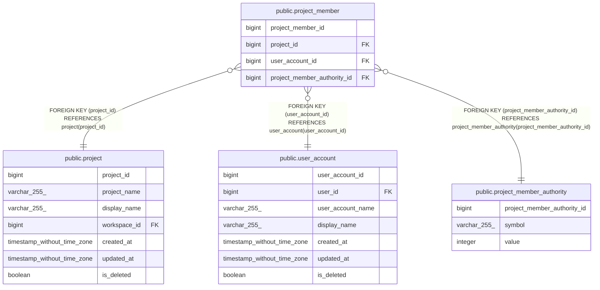

# public.project_member

## Description

## Columns

| Name                        | Type   | Default                                                   | Nullable | Children | Parents                                                               | Comment |
| --------------------------- | ------ | --------------------------------------------------------- | -------- | -------- | --------------------------------------------------------------------- | ------- |
| project_member_id           | bigint | nextval('project_member_project_member_id_seq'::regclass) | false    |          |                                                                       |         |
| project_id                  | bigint |                                                           | false    |          | [public.project](public.project.md)                                   |         |
| user_account_id             | bigint |                                                           | false    |          | [public.user_account](public.user_account.md)                         |         |
| project_member_authority_id | bigint |                                                           | false    |          | [public.project_member_authority](public.project_member_authority.md) |         |

## Constraints

| Name                                         | Type        | Definition                                                                                                 |
| -------------------------------------------- | ----------- | ---------------------------------------------------------------------------------------------------------- |
| project_member_user_account_id_fkey          | FOREIGN KEY | FOREIGN KEY (user_account_id) REFERENCES user_account(user_account_id)                                     |
| project_member_project_id_fkey               | FOREIGN KEY | FOREIGN KEY (project_id) REFERENCES project(project_id)                                                    |
| project_member_project_member_authority_fkey | FOREIGN KEY | FOREIGN KEY (project_member_authority_id) REFERENCES project_member_authority(project_member_authority_id) |
| project_member_pkey                          | PRIMARY KEY | PRIMARY KEY (project_member_id)                                                                            |

## Indexes

| Name                               | Definition                                                                                             |
| ---------------------------------- | ------------------------------------------------------------------------------------------------------ |
| project_member_pkey                | CREATE UNIQUE INDEX project_member_pkey ON public.project_member USING btree (project_member_id)       |
| project_member_project_id_idx      | CREATE INDEX project_member_project_id_idx ON public.project_member USING btree (project_id)           |
| project_member_user_account_id_idx | CREATE INDEX project_member_user_account_id_idx ON public.project_member USING btree (user_account_id) |

## Relations

---

> Generated by [tbls](https://github.com/k1LoW/tbls)
