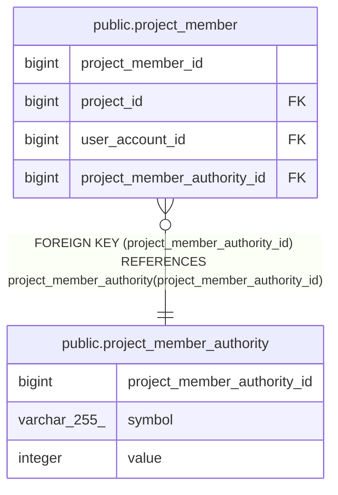

# public.project_member_authority

## Description

## Columns

| Name                        | Type         | Default                                                                       | Nullable | Children                                          | Parents | Comment |
| --------------------------- | ------------ | ----------------------------------------------------------------------------- | -------- | ------------------------------------------------- | ------- | ------- |
| project_member_authority_id | bigint       | nextval('project_member_authority_project_member_authority_id_seq'::regclass) | false    | [public.project_member](public.project_member.md) |         |         |
| symbol                      | varchar(255) |                                                                               | false    |                                                   |         |         |
| value                       | integer      |                                                                               | false    |                                                   |         |         |

## Constraints

| Name                          | Type        | Definition                                |
| ----------------------------- | ----------- | ----------------------------------------- |
| project_member_authority_pkey | PRIMARY KEY | PRIMARY KEY (project_member_authority_id) |

## Indexes

| Name                          | Definition                                                                                                                     |
| ----------------------------- | ------------------------------------------------------------------------------------------------------------------------------ |
| project_member_authority_pkey | CREATE UNIQUE INDEX project_member_authority_pkey ON public.project_member_authority USING btree (project_member_authority_id) |

## Relations

---

> Generated by [tbls](https://github.com/k1LoW/tbls)
