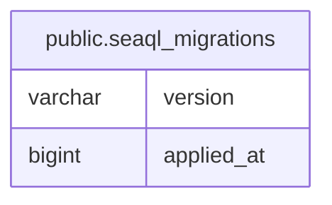

# public.seaql_migrations

## Description

## Columns

| Name       | Type    | Default | Nullable | Children | Parents | Comment |
| ---------- | ------- | ------- | -------- | -------- | ------- | ------- |
| version    | varchar |         | false    |          |         |         |
| applied_at | bigint  |         | false    |          |         |         |

## Constraints

| Name                  | Type        | Definition            |
| --------------------- | ----------- | --------------------- |
| seaql_migrations_pkey | PRIMARY KEY | PRIMARY KEY (version) |

## Indexes

| Name                  | Definition                                                                                 |
| --------------------- | ------------------------------------------------------------------------------------------ |
| seaql_migrations_pkey | CREATE UNIQUE INDEX seaql_migrations_pkey ON public.seaql_migrations USING btree (version) |

## Relations

---

> Generated by [tbls](https://github.com/k1LoW/tbls)
