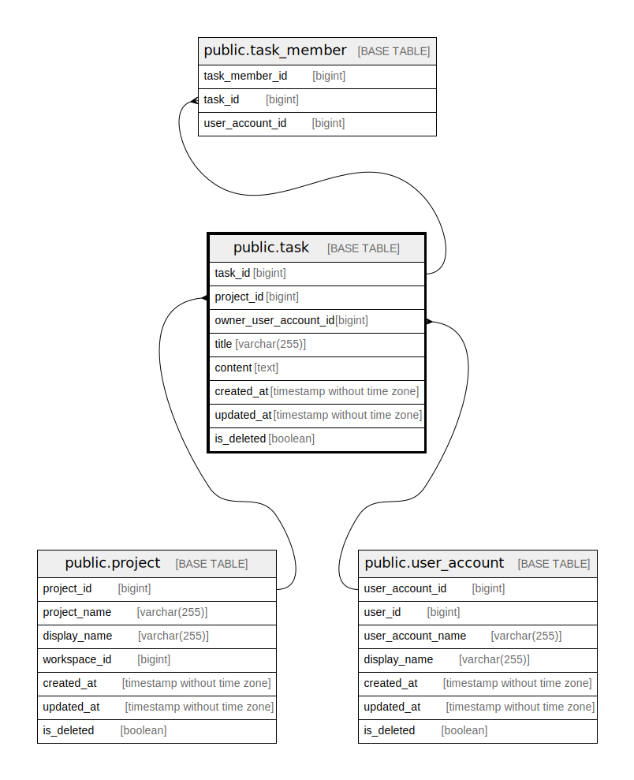

# public.task

## Description

Task table

## Columns

| Name                  | Type                        | Default                               | Nullable | Children                                    | Parents                                       | Comment               |
| --------------------- | --------------------------- | ------------------------------------- | -------- | ------------------------------------------- | --------------------------------------------- | --------------------- |
| task_id               | bigint                      | nextval('task_task_id_seq'::regclass) | false    | [public.task_member](public.task_member.md) |                                               | Task ID               |
| project_id            | bigint                      |                                       | false    |                                             | [public.project](public.project.md)           | Project ID            |
| owner_user_account_id | bigint                      |                                       | false    |                                             | [public.user_account](public.user_account.md) | Owner user account ID |
| title                 | varchar(255)                |                                       | false    |                                             |                                               | Title                 |
| content               | text                        |                                       | false    |                                             |                                               | Content               |
| created_at            | timestamp without time zone | CURRENT_TIMESTAMP                     | false    |                                             |                                               | Create date           |
| updated_at            | timestamp without time zone | CURRENT_TIMESTAMP                     | false    |                                             |                                               | Update date           |
| is_deleted            | boolean                     | false                                 | false    |                                             |                                               | Soft delete flag      |

## Constraints

| Name                            | Type        | Definition                                                                   |
| ------------------------------- | ----------- | ---------------------------------------------------------------------------- |
| task_owner_user_account_id_fkey | FOREIGN KEY | FOREIGN KEY (owner_user_account_id) REFERENCES user_account(user_account_id) |
| task_project_id_fkey            | FOREIGN KEY | FOREIGN KEY (project_id) REFERENCES project(project_id)                      |
| task_pkey                       | PRIMARY KEY | PRIMARY KEY (task_id)                                                        |

## Indexes

| Name                           | Definition                                                                                     |
| ------------------------------ | ---------------------------------------------------------------------------------------------- |
| task_pkey                      | CREATE UNIQUE INDEX task_pkey ON public.task USING btree (task_id)                             |
| task_project_id_idx            | CREATE INDEX task_project_id_idx ON public.task USING btree (project_id)                       |
| task_owner_user_account_id_idx | CREATE INDEX task_owner_user_account_id_idx ON public.task USING btree (owner_user_account_id) |

## Relations

---

> Generated by [tbls](https://github.com/k1LoW/tbls)
