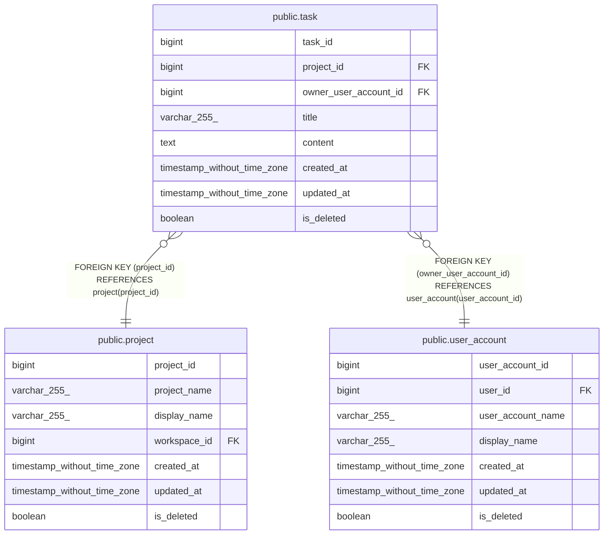

# public.task

## Description

## Columns

| Name                  | Type                        | Default                               | Nullable | Children | Parents                                       | Comment |
| --------------------- | --------------------------- | ------------------------------------- | -------- | -------- | --------------------------------------------- | ------- |
| task_id               | bigint                      | nextval('task_task_id_seq'::regclass) | false    |          |                                               |         |
| project_id            | bigint                      |                                       | false    |          | [public.project](public.project.md)           |         |
| owner_user_account_id | bigint                      |                                       | false    |          | [public.user_account](public.user_account.md) |         |
| title                 | varchar(255)                |                                       | false    |          |                                               |         |
| content               | text                        |                                       | false    |          |                                               |         |
| created_at            | timestamp without time zone | CURRENT_TIMESTAMP                     | false    |          |                                               |         |
| updated_at            | timestamp without time zone | CURRENT_TIMESTAMP                     | false    |          |                                               |         |
| is_deleted            | boolean                     | false                                 | false    |          |                                               |         |

## Constraints

| Name                            | Type        | Definition                                                                   |
| ------------------------------- | ----------- | ---------------------------------------------------------------------------- |
| task_owner_user_account_id_fkey | FOREIGN KEY | FOREIGN KEY (owner_user_account_id) REFERENCES user_account(user_account_id) |
| task_project_id_fkey            | FOREIGN KEY | FOREIGN KEY (project_id) REFERENCES project(project_id)                      |
| task_pkey                       | PRIMARY KEY | PRIMARY KEY (task_id)                                                        |

## Indexes

| Name                           | Definition                                                                                     |
| ------------------------------ | ---------------------------------------------------------------------------------------------- |
| task_pkey                      | CREATE UNIQUE INDEX task_pkey ON public.task USING btree (task_id)                             |
| task_project_id_idx            | CREATE INDEX task_project_id_idx ON public.task USING btree (project_id)                       |
| task_owner_user_account_id_idx | CREATE INDEX task_owner_user_account_id_idx ON public.task USING btree (owner_user_account_id) |

## Relations

---

> Generated by [tbls](https://github.com/k1LoW/tbls)
