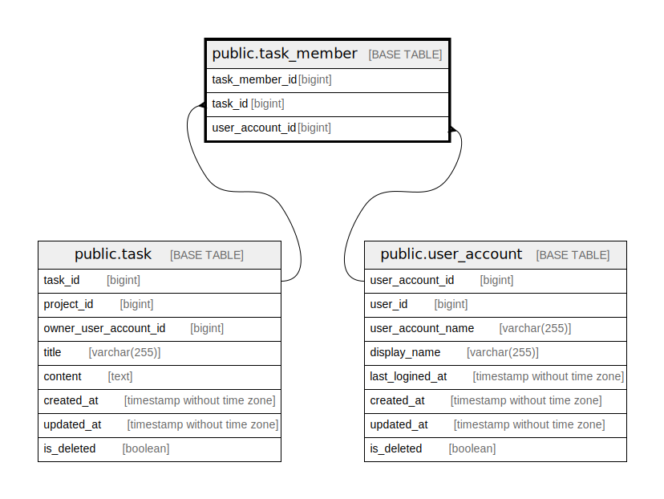

# public.task_member

## Description

Task member table

## Columns

| Name            | Type   | Default                                             | Nullable | Children | Parents                                       | Comment         |
| --------------- | ------ | --------------------------------------------------- | -------- | -------- | --------------------------------------------- | --------------- |
| task_member_id  | bigint | nextval('task_member_task_member_id_seq'::regclass) | false    |          |                                               | Task member ID  |
| task_id         | bigint |                                                     | false    |          | [public.task](public.task.md)                 | Task ID         |
| user_account_id | bigint |                                                     | false    |          | [public.user_account](public.user_account.md) | User account ID |

## Constraints

| Name                             | Type        | Definition                                                             |
| -------------------------------- | ----------- | ---------------------------------------------------------------------- |
| task_member_user_account_id_fkey | FOREIGN KEY | FOREIGN KEY (user_account_id) REFERENCES user_account(user_account_id) |
| task_member_task_id_fkey         | FOREIGN KEY | FOREIGN KEY (task_id) REFERENCES task(task_id)                         |
| task_member_pkey                 | PRIMARY KEY | PRIMARY KEY (task_member_id)                                           |

## Indexes

| Name                            | Definition                                                                                       |
| ------------------------------- | ------------------------------------------------------------------------------------------------ |
| task_member_pkey                | CREATE UNIQUE INDEX task_member_pkey ON public.task_member USING btree (task_member_id)          |
| task_member_task_id_idx         | CREATE INDEX task_member_task_id_idx ON public.task_member USING btree (task_id)                 |
| task_member_user_account_id_idx | CREATE INDEX task_member_user_account_id_idx ON public.task_member USING btree (user_account_id) |

## Relations

---

> Generated by [tbls](https://github.com/k1LoW/tbls)
