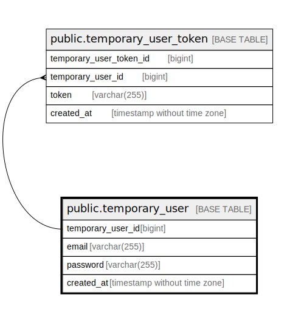

# public.temporary_user

## Description

Temporary user

## Columns

| Name              | Type                        | Default                                                   | Nullable | Children                                                      | Parents | Comment           |
| ----------------- | --------------------------- | --------------------------------------------------------- | -------- | ------------------------------------------------------------- | ------- | ----------------- |
| temporary_user_id | bigint                      | nextval('temporary_user_temporary_user_id_seq'::regclass) | false    | [public.temporary_user_token](public.temporary_user_token.md) |         | Temporary user ID |
| email             | varchar(255)                |                                                           | false    |                                                               |         | Email address     |
| password          | varchar(255)                |                                                           | false    |                                                               |         | Hashed password   |
| created_at        | timestamp without time zone | CURRENT_TIMESTAMP                                         | false    |                                                               |         | Create date       |

## Constraints

| Name                     | Type        | Definition                      |
| ------------------------ | ----------- | ------------------------------- |
| temporary_user_pkey      | PRIMARY KEY | PRIMARY KEY (temporary_user_id) |
| temporary_user_email_key | UNIQUE      | UNIQUE (email)                  |

## Indexes

| Name                     | Definition                                                                                       |
| ------------------------ | ------------------------------------------------------------------------------------------------ |
| temporary_user_pkey      | CREATE UNIQUE INDEX temporary_user_pkey ON public.temporary_user USING btree (temporary_user_id) |
| temporary_user_email_key | CREATE UNIQUE INDEX temporary_user_email_key ON public.temporary_user USING btree (email)        |

## Relations

---

> Generated by [tbls](https://github.com/k1LoW/tbls)
