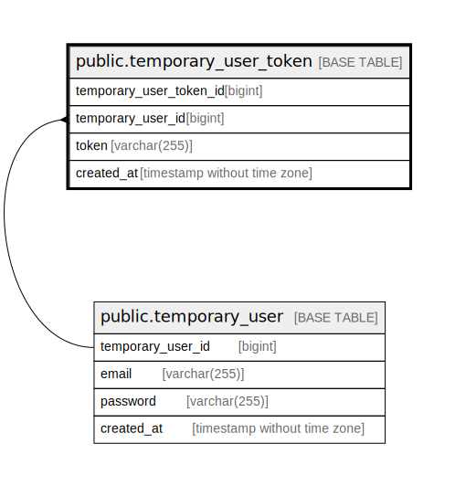

# public.temporary_user_token

## Description

## Columns

| Name                    | Type                        | Default                                                               | Nullable | Children | Parents                                           | Comment |
| ----------------------- | --------------------------- | --------------------------------------------------------------------- | -------- | -------- | ------------------------------------------------- | ------- |
| temporary_user_token_id | bigint                      | nextval('temporary_user_token_temporary_user_token_id_seq'::regclass) | false    |          |                                                   |         |
| temporary_user_id       | bigint                      |                                                                       | false    |          | [public.temporary_user](public.temporary_user.md) |         |
| token                   | varchar(255)                |                                                                       | false    |          |                                                   |         |
| created_at              | timestamp without time zone | CURRENT_TIMESTAMP                                                     | false    |          |                                                   |         |

## Constraints

| Name                                        | Type        | Definition                                                                   |
| ------------------------------------------- | ----------- | ---------------------------------------------------------------------------- |
| temporary_user_token_temporary_user_id_fkey | FOREIGN KEY | FOREIGN KEY (temporary_user_id) REFERENCES temporary_user(temporary_user_id) |
| temporary_user_token_pkey                   | PRIMARY KEY | PRIMARY KEY (temporary_user_token_id)                                        |

## Indexes

| Name                                       | Definition                                                                                                             |
| ------------------------------------------ | ---------------------------------------------------------------------------------------------------------------------- |
| temporary_user_token_pkey                  | CREATE UNIQUE INDEX temporary_user_token_pkey ON public.temporary_user_token USING btree (temporary_user_token_id)     |
| temporary_user_token_temporary_user_id_idx | CREATE INDEX temporary_user_token_temporary_user_id_idx ON public.temporary_user_token USING btree (temporary_user_id) |

## Relations

---

> Generated by [tbls](https://github.com/k1LoW/tbls)
