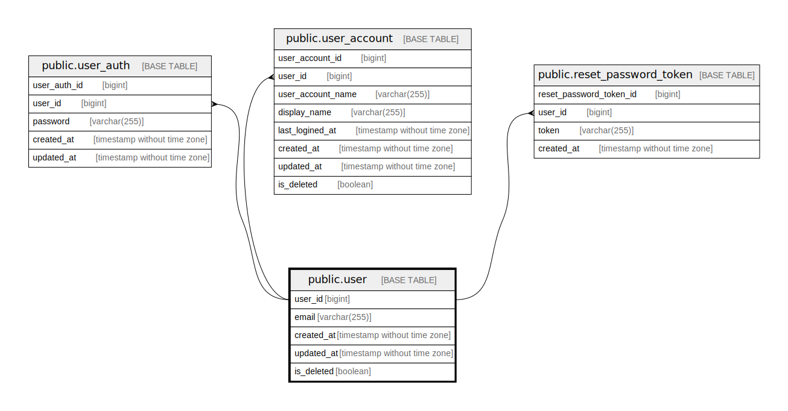

# public.user

## Description

User table

## Columns

| Name       | Type                        | Default                               | Nullable | Children                                                                                                                                                                                                  | Parents | Comment          |
| ---------- | --------------------------- | ------------------------------------- | -------- | --------------------------------------------------------------------------------------------------------------------------------------------------------------------------------------------------------- | ------- | ---------------- |
| user_id    | bigint                      | nextval('user_user_id_seq'::regclass) | false    | [public.user_auth](public.user_auth.md) [public.user_account](public.user_account.md) [public.reset_password_token](public.reset_password_token.md) [public.user_jwt_subject](public.user_jwt_subject.md) |         | User ID          |
| email      | varchar(255)                |                                       | false    |                                                                                                                                                                                                           |         | Email address    |
| created_at | timestamp without time zone | CURRENT_TIMESTAMP                     | false    |                                                                                                                                                                                                           |         | Create date      |
| updated_at | timestamp without time zone | CURRENT_TIMESTAMP                     | false    |                                                                                                                                                                                                           |         | Update date      |
| is_deleted | boolean                     | false                                 | false    |                                                                                                                                                                                                           |         | Soft delete flag |

## Constraints

| Name           | Type        | Definition            |
| -------------- | ----------- | --------------------- |
| user_pkey      | PRIMARY KEY | PRIMARY KEY (user_id) |
| user_email_key | UNIQUE      | UNIQUE (email)        |

## Indexes

| Name           | Definition                                                              |
| -------------- | ----------------------------------------------------------------------- |
| user_pkey      | CREATE UNIQUE INDEX user_pkey ON public."user" USING btree (user_id)    |
| user_email_key | CREATE UNIQUE INDEX user_email_key ON public."user" USING btree (email) |

## Relations

---

> Generated by [tbls](https://github.com/k1LoW/tbls)
