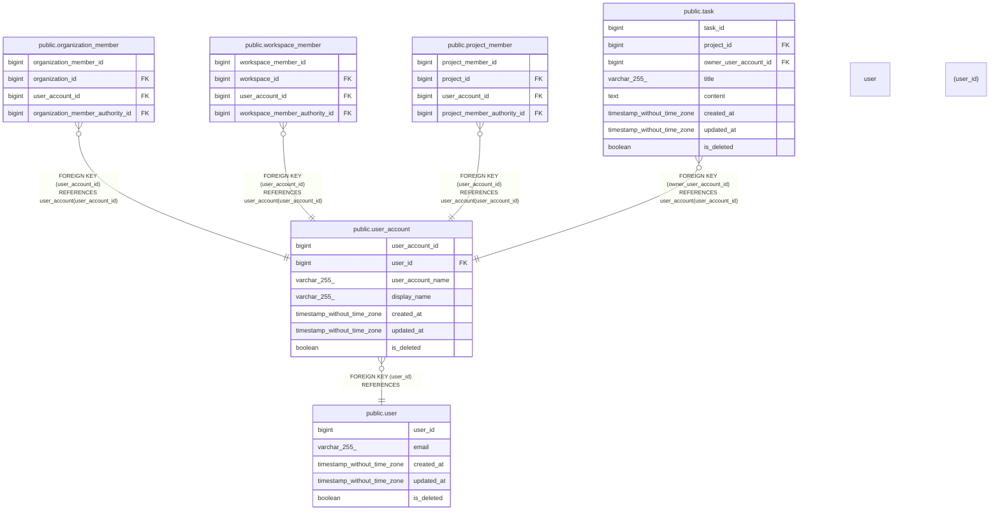

# public.user_account

## Description

## Columns

| Name              | Type                        | Default                                               | Nullable | Children                                                                                                                                                                                          | Parents                       | Comment |
| ----------------- | --------------------------- | ----------------------------------------------------- | -------- | ------------------------------------------------------------------------------------------------------------------------------------------------------------------------------------------------- | ----------------------------- | ------- |
| user_account_id   | bigint                      | nextval('user_account_user_account_id_seq'::regclass) | false    | [public.organization_member](public.organization_member.md) [public.workspace_member](public.workspace_member.md) [public.project_member](public.project_member.md) [public.task](public.task.md) |                               |         |
| user_id           | bigint                      |                                                       | false    |                                                                                                                                                                                                   | [public.user](public.user.md) |         |
| user_account_name | varchar(255)                |                                                       | false    |                                                                                                                                                                                                   |                               |         |
| display_name      | varchar(255)                |                                                       | false    |                                                                                                                                                                                                   |                               |         |
| created_at        | timestamp without time zone | CURRENT_TIMESTAMP                                     | false    |                                                                                                                                                                                                   |                               |         |
| updated_at        | timestamp without time zone | CURRENT_TIMESTAMP                                     | false    |                                                                                                                                                                                                   |                               |         |
| is_deleted        | boolean                     | false                                                 | false    |                                                                                                                                                                                                   |                               |         |

## Constraints

| Name                               | Type        | Definition                                       |
| ---------------------------------- | ----------- | ------------------------------------------------ |
| user_account_user_id_fkey          | FOREIGN KEY | FOREIGN KEY (user_id) REFERENCES "user"(user_id) |
| user_account_pkey                  | PRIMARY KEY | PRIMARY KEY (user_account_id)                    |
| user_account_user_account_name_key | UNIQUE      | UNIQUE (user_account_name)                       |

## Indexes

| Name                               | Definition                                                                                                    |
| ---------------------------------- | ------------------------------------------------------------------------------------------------------------- |
| user_account_pkey                  | CREATE UNIQUE INDEX user_account_pkey ON public.user_account USING btree (user_account_id)                    |
| user_account_user_account_name_key | CREATE UNIQUE INDEX user_account_user_account_name_key ON public.user_account USING btree (user_account_name) |
| user_account_user_id_idx           | CREATE INDEX user_account_user_id_idx ON public.user_account USING btree (user_id)                            |

## Relations

---

> Generated by [tbls](https://github.com/k1LoW/tbls)
