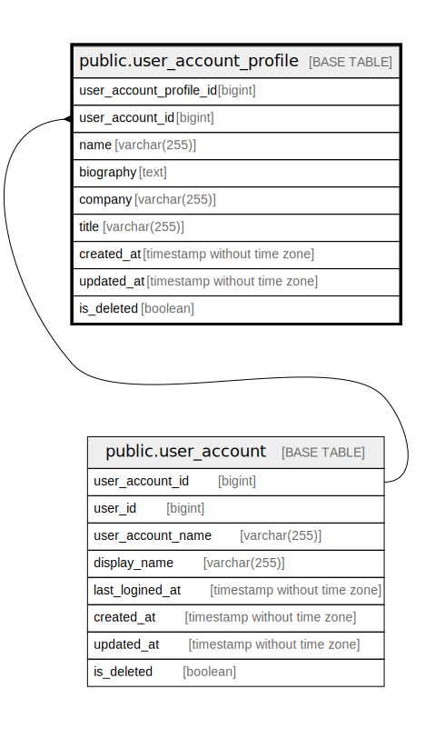

# public.user_account_profile

## Description

User account profile table

## Columns

| Name                    | Type                        | Default                                                               | Nullable | Children | Parents                                       | Comment                 |
| ----------------------- | --------------------------- | --------------------------------------------------------------------- | -------- | -------- | --------------------------------------------- | ----------------------- |
| user_account_profile_id | bigint                      | nextval('user_account_profile_user_account_profile_id_seq'::regclass) | false    |          |                                               | User account profile ID |
| user_account_id         | bigint                      |                                                                       | false    |          | [public.user_account](public.user_account.md) | User account ID         |
| name                    | varchar(255)                |                                                                       | true     |          |                                               | Name                    |
| biography               | text                        |                                                                       | true     |          |                                               | Biography               |
| company                 | varchar(255)                |                                                                       | true     |          |                                               | Company                 |
| title                   | varchar(255)                |                                                                       | true     |          |                                               | Title                   |
| created_at              | timestamp without time zone | CURRENT_TIMESTAMP                                                     | false    |          |                                               | Create date             |
| updated_at              | timestamp without time zone | CURRENT_TIMESTAMP                                                     | false    |          |                                               | Update date             |
| is_deleted              | boolean                     | false                                                                 | false    |          |                                               | Is deleted              |

## Constraints

| Name                                      | Type        | Definition                                                             |
| ----------------------------------------- | ----------- | ---------------------------------------------------------------------- |
| user_account_profile_user_account_id_fkey | FOREIGN KEY | FOREIGN KEY (user_account_id) REFERENCES user_account(user_account_id) |
| user_account_profile_pkey                 | PRIMARY KEY | PRIMARY KEY (user_account_profile_id)                                  |

## Indexes

| Name                                     | Definition                                                                                                         |
| ---------------------------------------- | ------------------------------------------------------------------------------------------------------------------ |
| user_account_profile_pkey                | CREATE UNIQUE INDEX user_account_profile_pkey ON public.user_account_profile USING btree (user_account_profile_id) |
| user_account_profile_user_account_id_idx | CREATE INDEX user_account_profile_user_account_id_idx ON public.user_account_profile USING btree (user_account_id) |

## Relations

---

> Generated by [tbls](https://github.com/k1LoW/tbls)
