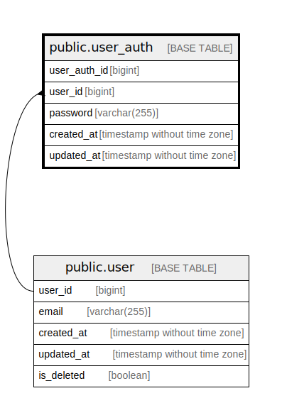

# public.user_auth

## Description

## Columns

| Name         | Type                        | Default                                         | Nullable | Children | Parents                       | Comment |
| ------------ | --------------------------- | ----------------------------------------------- | -------- | -------- | ----------------------------- | ------- |
| user_auth_id | bigint                      | nextval('user_auth_user_auth_id_seq'::regclass) | false    |          |                               |         |
| user_id      | bigint                      |                                                 | false    |          | [public.user](public.user.md) |         |
| password     | varchar(255)                |                                                 | false    |          |                               |         |
| created_at   | timestamp without time zone | CURRENT_TIMESTAMP                               | false    |          |                               |         |
| updated_at   | timestamp without time zone | CURRENT_TIMESTAMP                               | false    |          |                               |         |

## Constraints

| Name                   | Type        | Definition                                       |
| ---------------------- | ----------- | ------------------------------------------------ |
| user_auth_user_id_fkey | FOREIGN KEY | FOREIGN KEY (user_id) REFERENCES "user"(user_id) |
| user_auth_pkey         | PRIMARY KEY | PRIMARY KEY (user_auth_id)                       |

## Indexes

| Name                  | Definition                                                                        |
| --------------------- | --------------------------------------------------------------------------------- |
| user_auth_pkey        | CREATE UNIQUE INDEX user_auth_pkey ON public.user_auth USING btree (user_auth_id) |
| user_auth_user_id_idx | CREATE INDEX user_auth_user_id_idx ON public.user_auth USING btree (user_id)      |

## Relations

---

> Generated by [tbls](https://github.com/k1LoW/tbls)
