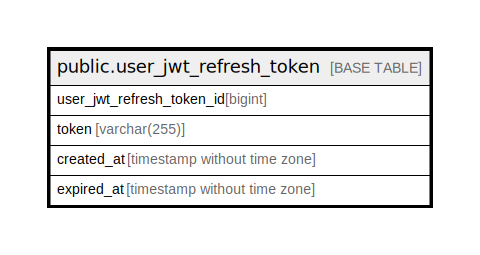

# public.user_jwt_refresh_token

## Description

User JWT refresh token

## Columns

| Name                      | Type                        | Default                                                                   | Nullable | Children | Parents | Comment                   |
| ------------------------- | --------------------------- | ------------------------------------------------------------------------- | -------- | -------- | ------- | ------------------------- |
| user_jwt_refresh_token_id | bigint                      | nextval('user_jwt_refresh_token_user_jwt_refresh_token_id_seq'::regclass) | false    |          |         | User JWT refresh token ID |
| token                     | varchar(255)                |                                                                           | false    |          |         | Token                     |
| created_at                | timestamp without time zone | CURRENT_TIMESTAMP                                                         | false    |          |         | Created at                |
| expired_at                | timestamp without time zone | CURRENT_TIMESTAMP                                                         | false    |          |         | Expired at                |

## Constraints

| Name                             | Type        | Definition                              |
| -------------------------------- | ----------- | --------------------------------------- |
| user_jwt_refresh_token_pkey      | PRIMARY KEY | PRIMARY KEY (user_jwt_refresh_token_id) |
| user_jwt_refresh_token_token_key | UNIQUE      | UNIQUE (token)                          |

## Indexes

| Name                             | Definition                                                                                                               |
| -------------------------------- | ------------------------------------------------------------------------------------------------------------------------ |
| user_jwt_refresh_token_pkey      | CREATE UNIQUE INDEX user_jwt_refresh_token_pkey ON public.user_jwt_refresh_token USING btree (user_jwt_refresh_token_id) |
| user_jwt_refresh_token_token_key | CREATE UNIQUE INDEX user_jwt_refresh_token_token_key ON public.user_jwt_refresh_token USING btree (token)                |

## Relations

---

> Generated by [tbls](https://github.com/k1LoW/tbls)
