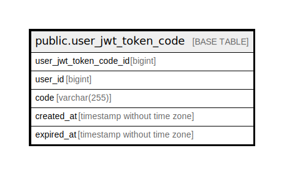

# public.user_jwt_token_code

## Description

User JWT token code

## Columns

| Name                   | Type                        | Default                                                             | Nullable | Children | Parents | Comment                |
| ---------------------- | --------------------------- | ------------------------------------------------------------------- | -------- | -------- | ------- | ---------------------- |
| user_jwt_token_code_id | bigint                      | nextval('user_jwt_token_code_user_jwt_token_code_id_seq'::regclass) | false    |          |         | User JWT token code ID |
| user_id                | bigint                      |                                                                     | false    |          |         | User ID                |
| code                   | varchar(255)                |                                                                     | false    |          |         | Code                   |
| created_at             | timestamp without time zone | CURRENT_TIMESTAMP                                                   | false    |          |         | Created at             |
| expired_at             | timestamp without time zone | CURRENT_TIMESTAMP                                                   | false    |          |         | Expired at             |

## Constraints

| Name                         | Type        | Definition                           |
| ---------------------------- | ----------- | ------------------------------------ |
| user_jwt_token_code_pkey     | PRIMARY KEY | PRIMARY KEY (user_jwt_token_code_id) |
| user_jwt_token_code_code_key | UNIQUE      | UNIQUE (code)                        |

## Indexes

| Name                         | Definition                                                                                                      |
| ---------------------------- | --------------------------------------------------------------------------------------------------------------- |
| user_jwt_token_code_pkey     | CREATE UNIQUE INDEX user_jwt_token_code_pkey ON public.user_jwt_token_code USING btree (user_jwt_token_code_id) |
| user_jwt_token_code_code_key | CREATE UNIQUE INDEX user_jwt_token_code_code_key ON public.user_jwt_token_code USING btree (code)               |

## Relations

---

> Generated by [tbls](https://github.com/k1LoW/tbls)
