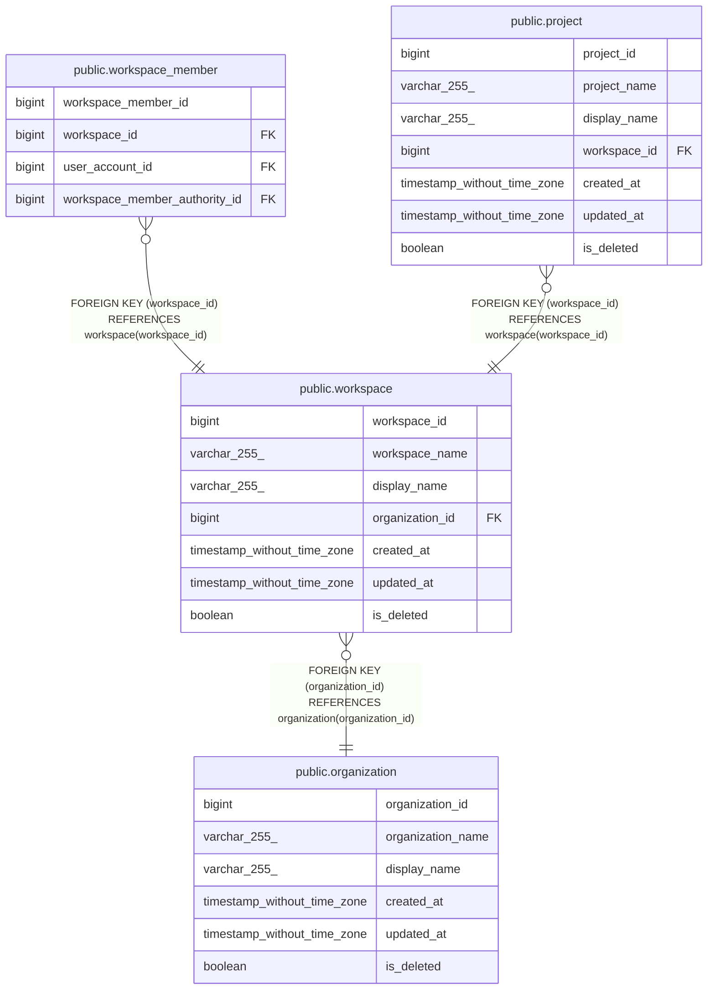

# public.workspace

## Description

## Columns

| Name            | Type                        | Default                                         | Nullable | Children                                                                                  | Parents                                       | Comment |
| --------------- | --------------------------- | ----------------------------------------------- | -------- | ----------------------------------------------------------------------------------------- | --------------------------------------------- | ------- |
| workspace_id    | bigint                      | nextval('workspace_workspace_id_seq'::regclass) | false    | [public.workspace_member](public.workspace_member.md) [public.project](public.project.md) |                                               |         |
| workspace_name  | varchar(255)                |                                                 | false    |                                                                                           |                                               |         |
| display_name    | varchar(255)                |                                                 | false    |                                                                                           |                                               |         |
| organization_id | bigint                      |                                                 | false    |                                                                                           | [public.organization](public.organization.md) |         |
| created_at      | timestamp without time zone | CURRENT_TIMESTAMP                               | false    |                                                                                           |                                               |         |
| updated_at      | timestamp without time zone | CURRENT_TIMESTAMP                               | false    |                                                                                           |                                               |         |
| is_deleted      | boolean                     | false                                           | false    |                                                                                           |                                               |         |

## Constraints

| Name                           | Type        | Definition                                                             |
| ------------------------------ | ----------- | ---------------------------------------------------------------------- |
| workspace_organization_id_fkey | FOREIGN KEY | FOREIGN KEY (organization_id) REFERENCES organization(organization_id) |
| workspace_pkey                 | PRIMARY KEY | PRIMARY KEY (workspace_id)                                             |
| workspace_workspace_name_key   | UNIQUE      | UNIQUE (workspace_name)                                                |

## Indexes

| Name                          | Definition                                                                                        |
| ----------------------------- | ------------------------------------------------------------------------------------------------- |
| workspace_pkey                | CREATE UNIQUE INDEX workspace_pkey ON public.workspace USING btree (workspace_id)                 |
| workspace_workspace_name_key  | CREATE UNIQUE INDEX workspace_workspace_name_key ON public.workspace USING btree (workspace_name) |
| workspace_organization_id_idx | CREATE INDEX workspace_organization_id_idx ON public.workspace USING btree (organization_id)      |

## Relations

---

> Generated by [tbls](https://github.com/k1LoW/tbls)
