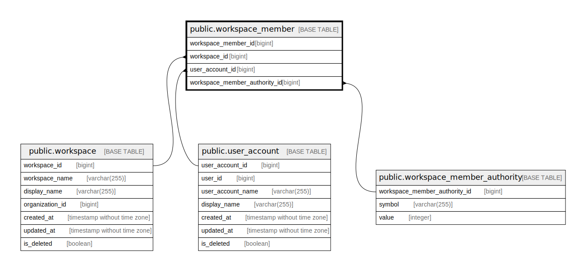

# public.workspace_member

## Description

Workspace member table

## Columns

| Name                          | Type   | Default                                                       | Nullable | Children | Parents                                                                   | Comment                       |
| ----------------------------- | ------ | ------------------------------------------------------------- | -------- | -------- | ------------------------------------------------------------------------- | ----------------------------- |
| workspace_member_id           | bigint | nextval('workspace_member_workspace_member_id_seq'::regclass) | false    |          |                                                                           | Workspace member ID           |
| workspace_id                  | bigint |                                                               | false    |          | [public.workspace](public.workspace.md)                                   | Workspace ID                  |
| user_account_id               | bigint |                                                               | false    |          | [public.user_account](public.user_account.md)                             | User account ID               |
| workspace_member_authority_id | bigint |                                                               | false    |          | [public.workspace_member_authority](public.workspace_member_authority.md) | Workspace member authority ID |

## Constraints

| Name                                             | Type        | Definition                                                                                                       |
| ------------------------------------------------ | ----------- | ---------------------------------------------------------------------------------------------------------------- |
| workspace_member_user_account_id_fkey            | FOREIGN KEY | FOREIGN KEY (user_account_id) REFERENCES user_account(user_account_id)                                           |
| workspace_member_workspace_id_fkey               | FOREIGN KEY | FOREIGN KEY (workspace_id) REFERENCES workspace(workspace_id)                                                    |
| workspace_member_workspace_member_authority_fkey | FOREIGN KEY | FOREIGN KEY (workspace_member_authority_id) REFERENCES workspace_member_authority(workspace_member_authority_id) |
| workspace_member_pkey                            | PRIMARY KEY | PRIMARY KEY (workspace_member_id)                                                                                |

## Indexes

| Name                                 | Definition                                                                                                 |
| ------------------------------------ | ---------------------------------------------------------------------------------------------------------- |
| workspace_member_pkey                | CREATE UNIQUE INDEX workspace_member_pkey ON public.workspace_member USING btree (workspace_member_id)     |
| workspace_member_workspace_id_idx    | CREATE INDEX workspace_member_workspace_id_idx ON public.workspace_member USING btree (workspace_id)       |
| workspace_member_user_account_id_idx | CREATE INDEX workspace_member_user_account_id_idx ON public.workspace_member USING btree (user_account_id) |

## Relations

---

> Generated by [tbls](https://github.com/k1LoW/tbls)
