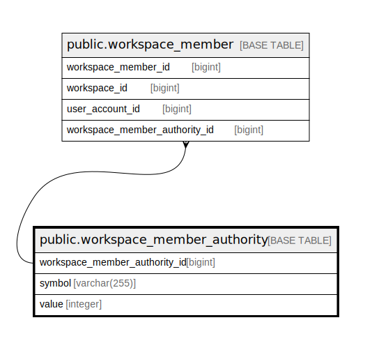

# public.workspace_member_authority

## Description

## Columns

| Name                          | Type         | Default                                                                           | Nullable | Children                                              | Parents | Comment |
| ----------------------------- | ------------ | --------------------------------------------------------------------------------- | -------- | ----------------------------------------------------- | ------- | ------- |
| workspace_member_authority_id | bigint       | nextval('workspace_member_authority_workspace_member_authority_id_seq'::regclass) | false    | [public.workspace_member](public.workspace_member.md) |         |         |
| symbol                        | varchar(255) |                                                                                   | false    |                                                       |         |         |
| value                         | integer      |                                                                                   | false    |                                                       |         |         |

## Constraints

| Name                            | Type        | Definition                                  |
| ------------------------------- | ----------- | ------------------------------------------- |
| workspace_member_authority_pkey | PRIMARY KEY | PRIMARY KEY (workspace_member_authority_id) |

## Indexes

| Name                            | Definition                                                                                                                           |
| ------------------------------- | ------------------------------------------------------------------------------------------------------------------------------------ |
| workspace_member_authority_pkey | CREATE UNIQUE INDEX workspace_member_authority_pkey ON public.workspace_member_authority USING btree (workspace_member_authority_id) |

## Relations

---

> Generated by [tbls](https://github.com/k1LoW/tbls)
