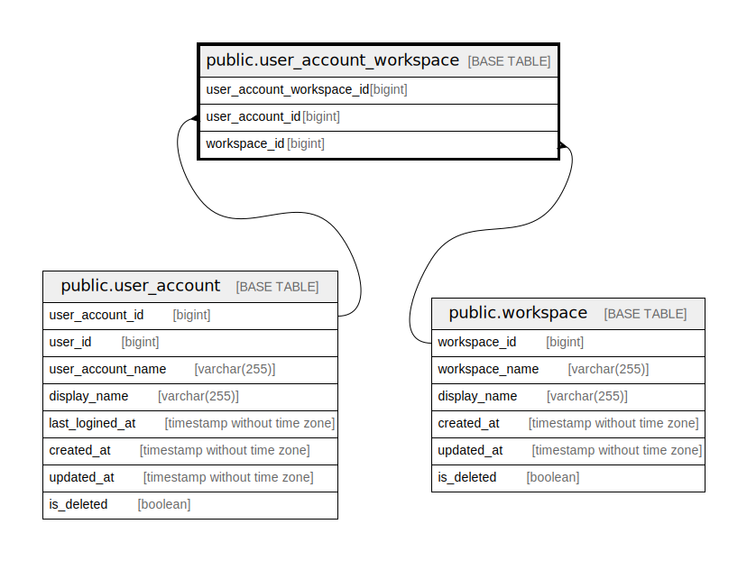

# public.user_account_workspace

## Description

User account workspace table

## Columns

| Name                      | Type   | Default                                                                   | Nullable | Children | Parents                                       | Comment                   |
| ------------------------- | ------ | ------------------------------------------------------------------------- | -------- | -------- | --------------------------------------------- | ------------------------- |
| user_account_workspace_id | bigint | nextval('user_account_workspace_user_account_workspace_id_seq'::regclass) | false    |          |                                               | User account workspace ID |
| user_account_id           | bigint |                                                                           | false    |          | [public.user_account](public.user_account.md) | User account ID           |
| workspace_id              | bigint |                                                                           | false    |          | [public.workspace](public.workspace.md)       | Workspace ID              |

## Constraints

| Name                                        | Type        | Definition                                                             |
| ------------------------------------------- | ----------- | ---------------------------------------------------------------------- |
| user_account_workspace_user_account_id_fkey | FOREIGN KEY | FOREIGN KEY (user_account_id) REFERENCES user_account(user_account_id) |
| user_account_workspace_workspace_id_fkey    | FOREIGN KEY | FOREIGN KEY (workspace_id) REFERENCES workspace(workspace_id)          |
| user_account_workspace_pkey                 | PRIMARY KEY | PRIMARY KEY (user_account_workspace_id)                                |

## Indexes

| Name                                       | Definition                                                                                                               |
| ------------------------------------------ | ------------------------------------------------------------------------------------------------------------------------ |
| user_account_workspace_pkey                | CREATE UNIQUE INDEX user_account_workspace_pkey ON public.user_account_workspace USING btree (user_account_workspace_id) |
| user_account_workspace_user_account_id_idx | CREATE INDEX user_account_workspace_user_account_id_idx ON public.user_account_workspace USING btree (user_account_id)   |
| user_account_workspace_workspace_id_idx    | CREATE INDEX user_account_workspace_workspace_id_idx ON public.user_account_workspace USING btree (workspace_id)         |

## Relations

---

> Generated by [tbls](https://github.com/k1LoW/tbls)
