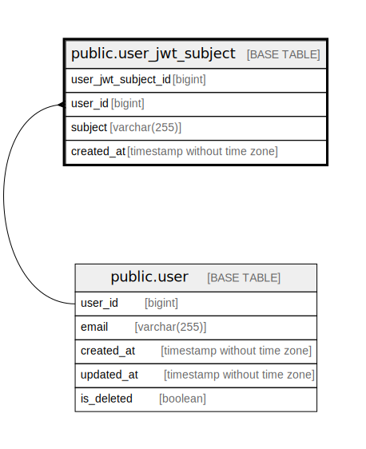

# public.user_jwt_subject

## Description

User JWT subject

## Columns

| Name                | Type                        | Default                                                       | Nullable | Children | Parents                       | Comment             |
| ------------------- | --------------------------- | ------------------------------------------------------------- | -------- | -------- | ----------------------------- | ------------------- |
| user_jwt_subject_id | bigint                      | nextval('user_jwt_subject_user_jwt_subject_id_seq'::regclass) | false    |          |                               | User JWT subject ID |
| user_id             | bigint                      |                                                               | false    |          | [public.user](public.user.md) | User ID             |
| subject             | varchar(255)                |                                                               | false    |          |                               | Subject             |
| created_at          | timestamp without time zone | CURRENT_TIMESTAMP                                             | false    |          |                               | Create date         |

## Constraints

| Name                          | Type        | Definition                                       |
| ----------------------------- | ----------- | ------------------------------------------------ |
| user_jwt_subject_user_id_fkey | FOREIGN KEY | FOREIGN KEY (user_id) REFERENCES "user"(user_id) |
| user_jwt_subject_pkey         | PRIMARY KEY | PRIMARY KEY (user_jwt_subject_id)                |
| user_jwt_subject_subject_key  | UNIQUE      | UNIQUE (subject)                                 |

## Indexes

| Name                         | Definition                                                                                             |
| ---------------------------- | ------------------------------------------------------------------------------------------------------ |
| user_jwt_subject_pkey        | CREATE UNIQUE INDEX user_jwt_subject_pkey ON public.user_jwt_subject USING btree (user_jwt_subject_id) |
| user_jwt_subject_subject_key | CREATE UNIQUE INDEX user_jwt_subject_subject_key ON public.user_jwt_subject USING btree (subject)      |
| user_jwt_subject_user_id_idx | CREATE INDEX user_jwt_subject_user_id_idx ON public.user_jwt_subject USING btree (user_id)             |

## Relations

---

> Generated by [tbls](https://github.com/k1LoW/tbls)
